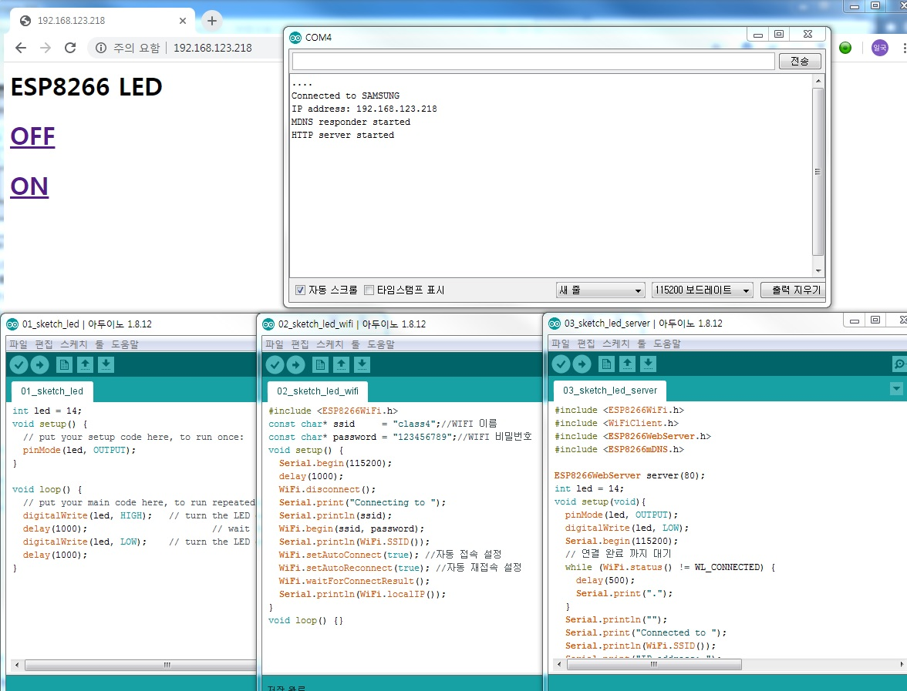
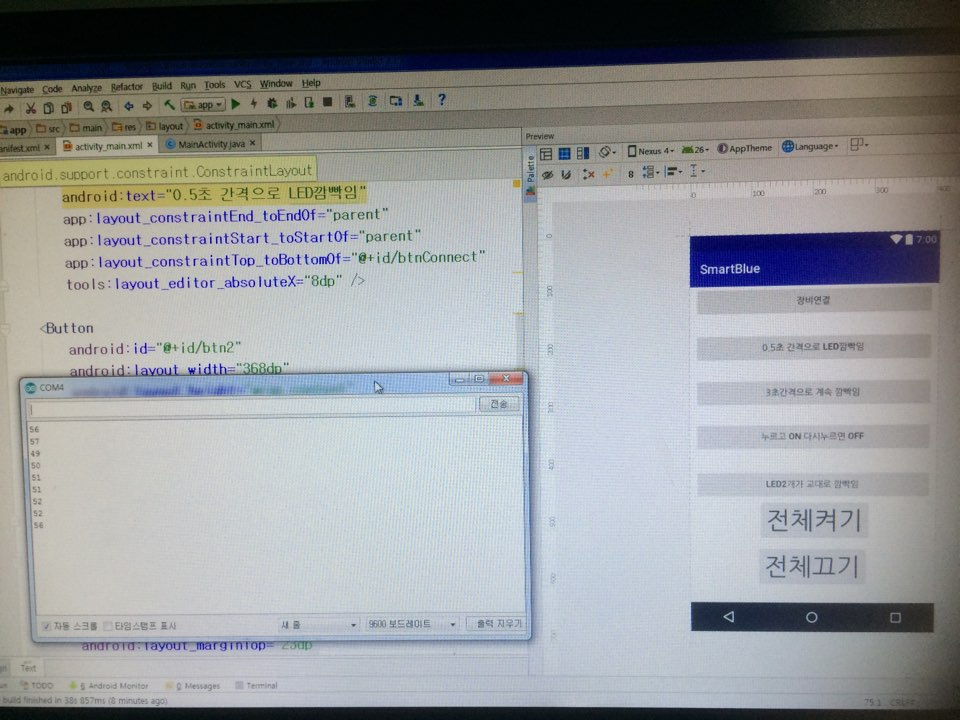

## 임베디드 애플리케이션 구현 (v15.0.0)
 
---

- [학습목차](https://github.com/miniplugin/human)
- 능력단위 요소: LM2001020323_16v4 + LM2001020324_17v5  
- 임베디드 애플리케이션 구현 환경 구축 + 임베디드 애플리케이션 구현

---

### 학습목표(아래)

- 기술 스펙 검토, 개발 환경 구축, 프로그래밍, 버전 관리 등을 수행할 수 있다.

### 핵심키워드(아래)

- 임베디드 운영 체제, 교차 개발 환경, 오픈소스, 소스코드 버전 관리, GUI 프로그래밍, 툴체인, 디버깅

### 기술 명세 검토(아래)

- 아두이노 IDE 개발툴 사용해서 스케치프로그램 작성
- 안드로이드 스튜디오 IDE 개발툴 사용(세부명세는 AndroidManifest.xml 에 명시)
- uses-permission android:name="android.permission.BLUETOOTH_ADMIN"
- uses-permission android:name="android.permission.BLUETOOTH"
- 수행작업확인(아래)

```
1. 스마트 폰(블루투스)으로 에서 아두이노 디바이스의 LED 신호를 제어하는 프로그램을 작성하시오.
2. 작성한 프로그램을 빌드하여 제대로 실행되는지 확인하시오.
  1) 1번 버튼 : 0.5초 간격으로 LED 깜박임.
  2) 2번 버튼 : 3초간으로 계속 깜박임l.
  3) 3번 버튼 : 누르고 ON/ 다시 누르면 OFF.
  4) 4번 버튼 : LED 2개가 교대로 깜박이게.
  5) 전체켜기/끄기버튼: LED 2개 모두 켜짐/꺼짐.

3. 빌드를 완료한 프로그램을 스마트폰과 아두이노의 연결된 상태에서 실행을 확인하시오.
4. 스마트폰과 아두이노와 블루투스의 인터페이스가 정확한지 확인하시오.
5.  github에 저장소를 만들고 add, commit 및 push 명령어를 이용하여 저장소에 소스코드를 
   업로드하시오.
6. github에 v2.0.0 이라는 태그를 만들고 해당 태그에 소스코드를 업로드하시오.
7. 디바이스 드라이브가 실행되는 결과를 캡쳐 하시오(하드웨어 2개 이상)
```

### 애플리케이션 개발 환경 구축하기(아래)

- 하드웨어준비: 노드MCU 보드, HC-06블루투스 모듈보드, 점퍼선 4개, 안드로이드폰(삼성갤럭시S1이상), USBto폰통신케이블
- 아두이노 IDE 설치 및 PC와 연결확인: UART통신
- 안드로이드 스튜디오 설치: https://developer.android.com/studio/install (아래 내용대로 진행 합니다.)
- 교육효과를 높이기 위해 다운받아서 설치하지 않고, 교사가 제공하는 안드로이드스튜디오 압축버전과 SDK버전 받아서 작업합니다. 
- 안드로이드 스튜디오 IDE로 HelloWorld프로젝트 만들어보기.(이 프로젝트를 가지고 실제 앱을 구현합니다.) 

### 애플리케이션 구현하기(아래)

-  노드MCU 프로그램 제작하기(파일명:SamrtNodeMCU.ino)

```
//주) 노드MCU 보드에 업로드시 와이파이보드 RX, TX핀을 제거하고 업로드
char rxVal;//스마트폰->노드MCU보드 전송값 변수 선언
//int LED_USER = 14;//외부(하단) LED 변수 선언 GPIO 14번=프린팅된번호D5
int LED_USER = 16;//외부(하단) LED 변수 선언 GPIO 16번=프린팅된번호D0
//주) 노드MCU는 LOW 와 HIGH 가 일반 아두이노와 반대
int ON = 0; //HIGH
int OFF = 1; //LOW

void setup() //프로그램 초기 1회만 실행됨
{
  //시리얼 모니터 설정(아래)
  Serial.begin(9600);//불루투스보드와 통신연결-아두이노내장 시리얼모니터에서 사용.
  Serial.println();//자바의 System.out.println()과 같음
  //노드MCU 보드 핀 설정(아래)
  pinMode(LED_BUILTIN, OUTPUT);//MCU보드의 상단 led 켜기 선언
  pinMode(LED_USER, OUTPUT);//외부(하단) led 켜기 선언
  digitalWrite(LED_BUILTIN, OFF);//MCU보드의 상단 led OFF
  digitalWrite(LED_USER, OFF);//외부(하단) led OFF
}//End setup()

void loop()                 //MCU보드 전원이 꺼질때까지 무한 실행됨
{
 static boolean flag = true;// flag 가 참일 경우
 if(Serial.available())//불루투스보드와 통신연결이 되었을때 if 실행
 {
  rxVal = Serial.read();                          
  Serial.println(int(rxVal));   //Serial Monitor로 수신값 출력
  switch(rxVal)
  {
    case '1' :                  // rxVal 이 1 일 경우
       for(int i=0; i<3; i++)   // 0부터 2까지 3회 반복
         {
          digitalWrite(LED_BUILTIN, ON);// MCU보드의 상단 led ON
          delay(500);           // 0.5초 기다림
          digitalWrite(LED_BUILTIN, OFF); // MCU보드의 상단 led OFF
          delay(500);
         }
         break;                 // switch문 종료
    case '2' :                  // rxVal 이 2 일 경우
       for(int i=0; i<3; i++)   // 0부터 2 까지 3회 반복
         {
          digitalWrite(LED_BUILTIN, ON);// MCU보드의 상단 led ON
          delay(3000);          // 3초 동안 기다림
          digitalWrite(LED_BUILTIN, OFF); // MCU보드의 상단 led OFF
          delay(3000);          // 3초 동안 기다림
         }
         break;                 // switch문 종료
    case '3' :                  // rxVal 이 4 일 경우 - 토글Toogle기능(똑딱이)
        {
          switch(flag)          // flag 가 참이면 
          {
            case true:
              digitalWrite(LED_BUILTIN, ON);// MCU보드의 상단 led ON
              flag=false;           // flag 변수에 거짓값 저장
              break;                // 내부 switch문 종료
            case false:            // flag가 거짓이면
              digitalWrite(LED_BUILTIN, OFF);// MCU보드의 상단 led OFF
              flag=true;           // flag 변수에 참값 저장
              break;               // 내부 switch문 종료
         }
         break;                   // switch문 종료
       }
    case'4' :                     //rxVal 이 5 이면
        for(int i=0; i<3; i++)    // 0부터 2 까지 3회 반복
         {
          digitalWrite(LED_USER, OFF);  // 외부(하단) led OFF
          digitalWrite(LED_BUILTIN, ON);  // MCU보드의 상단 led ON
          delay(500);                   // 0.5 초 후 
          digitalWrite(LED_USER, ON);  // 외부(하단) led ON
          digitalWrite(LED_BUILTIN, OFF);   // MCU보드의 상단 led OFF
          delay(500);                  // 0.5초 후 반복 (x 3회)
         }                             // 3회 후 반목분 종료
        digitalWrite(LED_USER, OFF);   // 외부(하단) led OFF
        digitalWrite(LED_BUILTIN, OFF);// MCU보드의 상단 led OFF
        break;                         // switch문 종료
    case '8' :                         //rxVal 이 s 일 경우 모든 led 꺼짐
        digitalWrite(LED_USER, ON);   // 외부(하단)`                                                                                                                                                                                      led OFF
        digitalWrite(LED_BUILTIN, ON);// MCU보드의 상단 led OFF 
        break;                         // switch문 종료
    case '9' :                         //rxVal 이 s 일 경우 모든 led 꺼짐
        digitalWrite(LED_USER, OFF);   // 외부(하단)`                                                                                                                                                                                      led OFF
        digitalWrite(LED_BUILTIN, OFF);// MCU보드의 상단 led OFF 
        break;                         // switch문 종료
  }// End switch문
 }// End if문
}// End loop문

```

- 안드로이드 스튜디오를 사용해서 앱만들기 핵심파일3개(아래소스 참조)
- [앱 명세파일 download this](git_img/AndroidManifest.xml)
- [화면처리파일 download this](git_img/activity_main.xml)
- [자바프로그램처리 download this](git_img/MainActivity.java)
  
```
앱 명세파일 : AndroidManifest.xml
화면처리파일: activity_main.xml
자바프로그램처리: MainActivity.java
```
### 위 소스를 참고해서 교사지도아래 학생이 제작(아래)
-화면처리파일: activity_main.xml(아래-위 소스와 틀린점은 button에 메서드명이 연결됨)

```
<?xml version="1.0" encoding="utf-8"?>
<android.support.constraint.ConstraintLayout xmlns:android="http://schemas.android.com/apk/res/android"
    xmlns:app="http://schemas.android.com/apk/res-auto"
    xmlns:tools="http://schemas.android.com/tools"
    android:layout_width="match_parent"
    android:layout_height="match_parent"
    tools:context="com.example.app.smartbluetooth.MainActivity">

    <LinearLayout
        android:layout_width="368dp"
        android:layout_height="495dp"
        android:orientation="vertical"
        tools:layout_editor_absoluteX="8dp"
        tools:layout_editor_absoluteY="8dp">

        <Button
            android:id="@+id/btnConnect"
            android:layout_width="match_parent"
            android:layout_height="wrap_content"
            android:onClick="fnConnect"
            android:text="블루투스연결" />

        <Button
            android:id="@+id/btn1"
            android:layout_width="match_parent"
            android:layout_height="wrap_content"
            android:onClick="fnBtn1"
            android:text="0.5초간격으로 깝빡임" />
    </LinearLayout>
</android.support.constraint.ConstraintLayout>
```
- 자바프로그램처리: MainActivity.java(아래)

```
package com.example.app.smartbluetooth;

import android.bluetooth.BluetoothAdapter;
import android.bluetooth.BluetoothDevice;
import android.bluetooth.BluetoothSocket;
import android.content.Intent;
import android.support.v7.app.AppCompatActivity;
import android.os.Bundle;
import android.view.View;
import android.widget.Toast;

import java.io.IOException;
import java.io.OutputStream;
import java.util.Set;
import java.util.UUID;

public class MainActivity extends AppCompatActivity {
    //클래스 변수 선언(클래스전역변수)
    BluetoothAdapter mBluetoothAdapter;//장치(중간어댑터담당)<->앱
    BluetoothSocket mSocket;//장치<->(소켓통신담당)앱
    BluetoothDevice mDevice;//블루투스장치 담당
    OutputStream mOutputStream;//앱->블루투스 데이터전송 클래스
    String mBluetoothName = "HC-06";//블루투스 이름(장비고유값)
    int mState;//블루투스 접속 상태 확인변수

    @Override
    protected void onCreate(Bundle savedInstanceState) {
        super.onCreate(savedInstanceState);
        setContentView(R.layout.activity_main);
    }

    public void fnConnect(View view) {
        try {
            findBT();
            mState = 1;
        } catch (IOException e) {
            mState = 0;
            Toast.makeText(MainActivity.this,"블루투스에 연결되지 않았습니다.", Toast.LENGTH_LONG).show();
            e.printStackTrace();
        }
    }

    //블루투스 검색 매서드
    void findBT() throws IOException {
        //블루투스 검색
        mBluetoothAdapter = BluetoothAdapter.getDefaultAdapter();
        if(!mBluetoothAdapter.isEnabled()) {
            //인텐트에 데이터를 담아서 액티비티에 보낸다.
            Intent intentEnableBluetooth = new Intent(BluetoothAdapter.ACTION_REQUEST_ENABLE);
            startActivityForResult(intentEnableBluetooth,1);
        }
        Set<BluetoothDevice> paieredDevices = mBluetoothAdapter.getBondedDevices();
        if(paieredDevices.size() > 0) {
            for(BluetoothDevice device : paieredDevices) {
                if(device.getName().equals("HC-06")){
                    mDevice = device;
                    break;
                }
            }
        }
        //블루투스 범용 포트아이디(Universally Unique Identifiers) 소켓생성시 필요
        //TCP프로토콜과 같은 기능이 UUID
        UUID uuid = UUID.fromString("00001101-0000-1000-8000-00805f9b34fb");
        mSocket = mDevice.createRfcommSocketToServiceRecord(uuid);
        mSocket.connect();
        mOutputStream = mSocket.getOutputStream();
    }

    //프로그램 종료시 변수값 메로리에서 지우기
    @Override
    protected void onDestroy() {
        if(mOutputStream != null) {
            try {
                mOutputStream.close();
            } catch (IOException e) {
                e.printStackTrace();
            }
            mOutputStream = null;
        }
        if(mSocket != null) {
            try {
                mSocket.close();
            } catch (IOException e) {
                e.printStackTrace();
            }
            mSocket = null;
        }
        super.onDestroy();
        System.exit(0);//프로그램 종료
    }

    public void fnBtn1(View view) {
        if(mState == 1) {
            try {
                mOutputStream.write('1');
            } catch (IOException e) {
                Toast.makeText(MainActivity.this,"노드MCU 보드쪽으로 값이 전송되지 않았습니다.", Toast.LENGTH_LONG).show();
                e.printStackTrace();
            }
        }else{
            Toast.makeText(MainActivity.this,"블루투스에 연결되지 않았습니다.", Toast.LENGTH_LONG).show();
        }
    }
}
```

### 결과확인(아래)
- 하드웨어 구성

- 소프트웨어 구성

- [앱프로그램소스 download this](git_img/SmartBlue.zip)

### 참고자료 출처(아래)
- 학습모듈: https://ncs.go.kr/unity/th03/ncsSearchMain.do 20.정보통신 > 01.정보기술 > 02.정보기술개발 > 03.임베디드SW 엔지니어링
- 노드MUC보드 참고자료: https://s3.ap-northeast-2.amazonaws.com/mechaimage/book/NodeMCU.pdf
- CPU가 NX 지원 + 바이오스에서 VT-x enable 이 되어 있어야함.(교육생PC에서 지원 않하는 PC가 있기 때문에 안드로이드 버추어 디바이스(AVD)는 사용하지 않고, 실제 휴대폰을 PC에 연결하여서 앱을 빌드 합니다.)
기술참조: https://bonobono-no1.tistory.com/5
CPU확인SW: https://docs.microsoft.com/ko-kr/sysinternals/downloads/coreinfo
- 안드로이드폰(갤럭시) 설정에서 블루투스 검색 및 찾기
https://blog.naver.com/PostView.nhn?blogId=eduino&logNo=221121406317
- 블루투스 연결 확인 앱(Bluetooth Terminal) 본인이 작업한 앱 실행전 블루투스 연결 확인용
https://play.google.com/store/apps/details?id=ptah.apps.bluetoothterminal&hl=ko