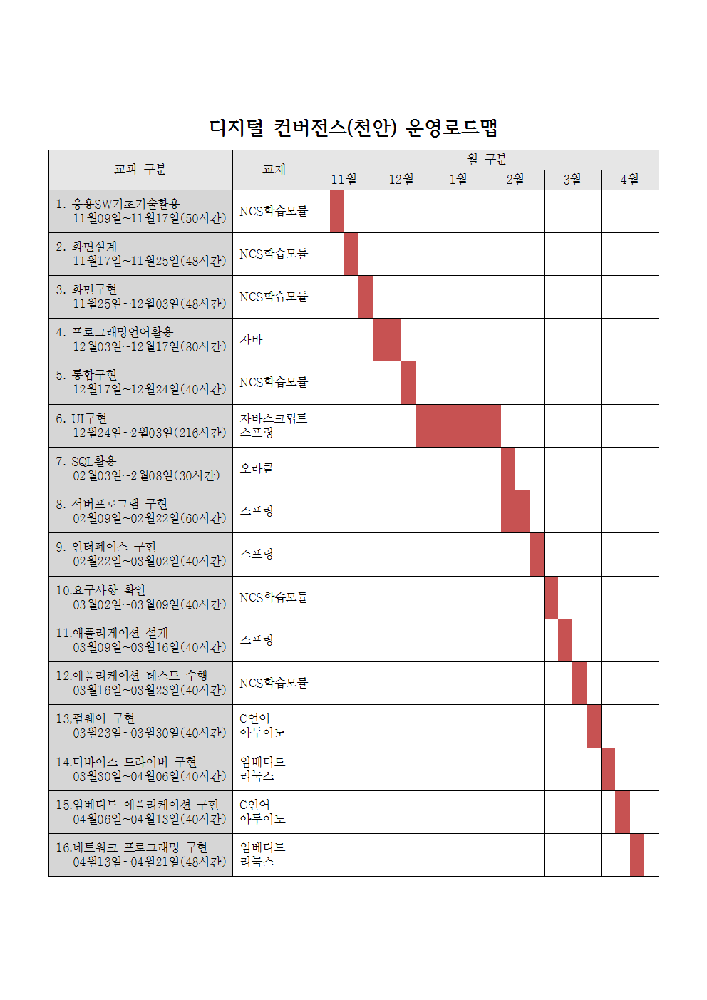

## 커리큘럼
 
---

- [학습목차](https://github.com/miniplugin/human)
- 학습목표
```
디지털 기술을 기반으로 다양한 기기의 융합, 콘텐츠의 융합을 통해 새로운 형태의 제품이나 융합서비스를 창출합니다.
기기/콘텐츠의 기획/설계/제작/운용/시험을 수행 할 수 있는 4차산업혁명의 핵심적인 과정을 습득합니다.
```
- [목차사용법]깃허브 태그[tag] 클릭, 예) [v1.0.0] <- 아래에서 해당부분 클릭하시면 해당과목으로 이동합니다.  

---

### [v1.0.0](https://github.com/miniplugin/human/tree/v1.0.0) 응용SW기초기술활용 (2001020216_15v3)

- 5월11일~5월19일(50시간) : 사전평가(5월11일) /사후평가(5월19일,2시간)
- 평가항목 : 사후 + 평가자체크리스트 + 서술형

### [v2.0.0](https://github.com/miniplugin/human/tree/v2.0.0) 화면설계 (2001020224_16v4)

- 5월19일~5월27일(48시간) : 사전평가(5월19일) /사후평가(5월27일)
- 평가항목 : 사후 + 포트폴리오

### [v3.0.0](https://github.com/miniplugin/human/tree/v3.0.0) 화면구현 (2001020225_16v4)

- 5월27일~6월4일(48시간) : 사전평가(5월27일) /사후평가(6월4일)
- 평가항목 : 사후 + 포트폴리오

### [v4.0.0](https://github.com/miniplugin/human/tree/v4.0.0) 프로그래밍언어활용 (2001020215_15v3)

- 6월4일~6월18일(80시간) : 사전평가(6월4일) /사후평가(6월18일)
- 평가항목 : 사후 + 문제해결시나리오

### [v5.0.0](https://github.com/miniplugin/human/tree/v5.0.0) 통합구현 (2001020206_16v4)

- 6월18일~6월25일(40시간) : 사전평가(6월18일) /사후평가(6월25일)
- 평가항목 : 사후 + 문제해결시나리오

### [v6.0.0](https://github.com/miniplugin/human/tree/v6.0.0) UI구현 (2001020708_17v2)

- 6월25일~8월3일(216시간) : 사전평가(6월25일) /사후평가(8월3일)
- 평가항목 : 사후 + 포트폴리오

### [v7.0.0](https://github.com/miniplugin/human/tree/v7.0.0) SQL활용 (2001020413_16v3)

- 8월3일~8월6일(30시간) :  사전평가(8월3일) /사후평가(8월6일)
- 평가항목 : 사후 + 문제해결시나리오 + 서술형

### [v8.0.0](https://github.com/miniplugin/human/tree/v8.0.0) 서버프로그램 구현 (2001020211_16v4)

- 8월7일~8월18일(60시간) : 사전평가(8월7일) /사후평가(8월18일)
- 평가항목 : 사후 + 포트폴리오

### [v9.0.0](https://github.com/miniplugin/human/tree/v9.0.0) 인터페이스 구현 (2001020212_16v4)

- 8월18일~8월25일(40시간) : 사전평가(8월18일) /사후평가(8월24일)
- 평가항목 : 사후 + 문제해결시나리오

### [v10.0.0](https://github.com/miniplugin/human/tree/v10.0.0) 요구사항 확인 (2001020201_16v3)

- 8월25일~9월1일(40시간) : 사전평가(8월25일) /사후평가(9월1일)
- 평가항목 : 사후 + 평가자체크리스트

### [v11.0.0](https://github.com/miniplugin/human/tree/v11.0.0) 애플리케이션 설계 (2001020221_16v4)

- 9월1일~9월8일(40시간) : 사전평가(9월1일) /사후평가(9월8일)
- 평가항목 : 사후 + 평가자체크리스트 + 서술형

### [v12.0.0](https://github.com/miniplugin/human/tree/v12.0.0) 애플리케이션 테스트 수행 (2001020227_16v4)

- 9월8일~9월15일(40시간) : 사전평가(9월8일) /사후평가(9월15일)
- 평가항목 : 사후 + 문제해결시나리오

### [v13.0.0](https://github.com/miniplugin/human/tree/v13.0.0) 펌웨어 구현 (2001020314_17v5)

- 9월15일~9월22일(40시간) : 사전평가(9월15일) /사후평가(9월22일)
- 평가항목 : 사후 + 문제해결시나리오

### [v14.0.0](https://github.com/miniplugin/human/tree/v14.0.0) 디바이스 드라이버 구현 (2001020320_17v5)

- 9월22일~9월29일(40시간) : 사전평가(9월22일) /사후평가(9월29일)
- 평가항목 : 사후 + 문제해결시나리오

### [v15.0.0](https://github.com/miniplugin/human/tree/v15.0.0) 임베디드 애플리케이션 구현 (2001020324_17v5)

- 9월29일~10월12일(40시간) : 사전평가(9월29일) /사후평가(10월12일)
- 평가항목 : 사후 + 포트폴리오

### [v16.0.0](https://github.com/miniplugin/human/tree/v16.0.0) 네트워크 프로그래밍 구현 (2001020508_14v2)

- 10월12일~10월19일(48시간) : 사전평가(10월12일) /사후평가(10월19일)
- 평가항목 : 사후 + 포트폴리오

### 교재별 소스 정보(아래)
- 스프링5 
---
#### 참고: https://github.com/miniplugin/edu_ora/blob/master/spring5.md
#### 소스: https://github.com/madvirus/spring5fs
---

- 이것이자바다
--- 
#### 참고: https://www.youtube.com/playlist?list=PLVsNizTWUw7FPokuK8Cmlt72DQEt7hKZu
#### 소스: https://www.hanbit.co.kr/support/supplement_list.html
---

- C언어 
---
#### 참고: https://freelec.co.kr/lecture/c-%EC%96%B8%EC%96%B4%EC%9D%98-%EB%B3%B8%EC%A7%88%EC%9D%84-%ED%8C%8C%ED%97%A4%EC%B9%98%EB%8B%A4/
#### 소스: https://freelec.co.kr/datacenter/?mode=list&board_name=DataCenter2&order_by=fn_pid&order_type=desc&category1=&category2=&category3=&search_field=fn_title&search_text=C+%EC%96%B8%EC%96%B4+%EB%B3%B8%EC%83%89
---

- 임베디드리눅스: 강사에게 받음.

- 아두이노 
---
#### 소스: http://www.kwangmoonkag.co.kr/sub3/sub3_1.html?target=Board_List&DB=sub3_1&Mode=View&Num=852&page=1&S=S&val=0&Word=&Board_TYPE=&PHPSESSID=03901ac7ddf268e8562dfba0413f5f1a
---

- NCS학습모듈 
---
#### 소스: https://ncs.go.kr/unity/th03/ncsSearchMain.do
---