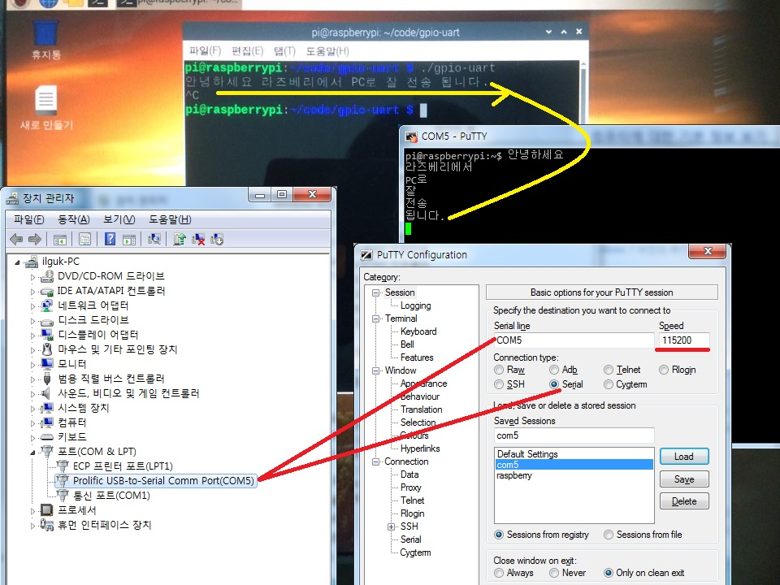

## 디바이스 드라이버 구현 (v14.0.0)
 
---

- [학습목차](https://github.com/miniplugin/human)
- 능력단위 요소: 2001020320_17v5

---

### 학습목표(아래)

- 분석 설계된 디바이스 드라이버의 개발 환경 구성하기, 디바이스 드라이버 구현과 구현된 소스코드 인스펙션을 할 수 있다.

### 핵심키워드(아래)

- 교차 개발 환경, 디바이스 드라이버, 소스코드 인스펙션

### 디바이스 드라이버구현하기(아래)

- 워밍업: C언어 은행입출금, 학점처리, 구구단 프로그램 코드 실행(구름IDE 사용)
- 설계도면 샘플다운로드: Fritzing프리징(Free버전)프로그램 > 부품 > core > Computer > RPi3 선택
- GCC컴파일버전확인: gcc --version ( 설치않되어 있을때 sudo apt-get install gcc )
- Git버전확인: git --version ( 설치않되어 있을때 sudo apt-get install git-core )
- C언어로 GPIO사용준비: wiringPi 라이브러리 사용가능 확인(아래코드)

```
//wiringPi 다운로드
mkdir code
cd code
git clone https://github.com/WiringPi/WiringPi
cd WiringPi
./build
//와이어링파이 설치 확인
gpio -v
//C언어에서 사용가능한 와이어링파이 gpio 포트확인
gpio readall 
```

### 디바이스 LED 켜고 끄는 프로그램 실행하기(아래)

```
//핀 연결과 사용 함수
GPIO29(pin40번), Ground pin39번

#define
매크로 정의하기 #define은 특정 값에 이름을 붙이거나 코드를 조합하여 함수 형태로 만들 수 있다. 
매크로를 사용하면 전처리기를 거쳐 내부적으로 소스 코드가 일괄 변환된다.

pinMode
특정 핀을 입력 또는 출력으로 동작하도록 설정

digitalWrite
특정 핀을 HIGH(켬) 또는 LOW(끔) 으로 만드는 함수

delay
매개변수에 정한 시간(밀리 초) 동안 프로그램 멈추게 하는 역할을 한다(1초는 1000 밀리 초).

```

```
#include <stdio.h>
#include <wiringPi.h>

#define LED1 29 //LED1을 29핀으로 지정

int main(void)
{
  int input;
  int cnt;

  if(wiringPiSetup() == -1) return 1;

  pinMode(LED1, OUTPUT) ;           //LED1을 출력으로 설정

  while(1)                          //무한반복
  {
	  printf("1 입력시 깜박임시작 : 0 입력시 종료\n");
	  scanf("%d",&input);                 //입력받는 값을 input에 저장
	
	  for(cnt=0; cnt<=3; cnt++)           //세번 반복
	  {
		  if(input==1)                    //input이 1일경우
		  {
			  printf("LED HIGH\n");
			  digitalWrite(LED1, HIGH);  //LED1번을 켬
			  delay(1000);               //1초간
			
			  printf("LED LOW\n");
			  digitalWrite(LED1,LOW);   //LED1번을 끔
			  delay(1000);              //1초간
		  }
	  }
	
	  if(input==0){
		  digitalWrite(LED1, LOW);
		  break;                        //n에 0이 입력될 경우 while문을 탈출
	  }
  }
  return 0;
}

//소스코드 컴파일
pwd -> /home/pi/code 현재경로 확인
mkdir gpio-led
nano gpio-led.c
gcc -o gpio-led gpio-led.c -lwiringPi
//실행
./gpio-led
```

### 디바이스 통신 드라이버 개발환경 준비하기 (아래)

- PC와 연결: PC드라이버PL-2303HX설치 http://www.ifamilysoftware.com/news37.html(윈7에서 않될 수 있음-아래 참조에서 다운로드)
	참조: http://www.jkelec.co.kr/img/arm/cortex-m3/rabbit_stm32_lqfp64/stm32f10x_pl2303_usbdriver.html
- [download this](git_img/pl2303.zip)
- 설계된 디바이스 드라이버구현 : https://cccding.tistory.com/93
블루투스 사용중지필요: 이유는 Bluetooth와 UART가 같은 포트를 사용하여 둘중 한가지만 사용가능하기 때문입니다.(아래코드로 처리)

```
sudo nano /boot/config.txt //파일을 열고 아래2줄을 추가합니다.
#disable bluetooth
dtoverlay=pi3-disable-bt
//========================
sudo systemctl disable hciuart //블루투스가 Serial을 사용하도록 한다.
sudo reboot //라즈베리파이에서 블루투스가 않보이는 것을 확인
```

### 디바이스 통신 드라이버 소스코드 실행하기(아래)

```
//소스코드 컴파일
pwd -> /home/pi/code 현재경로 확인
mkdir gpio-uart
nano gpio-uart.c (내용은 아래 디바이스 통신 드라이버 소스코드 인스펙션하기 복사)
gcc -o gpio-uart gpio-uart.c -lwiringPi
//실행
./gpio-uart

```

### 디바이스 통신 드라이버 소스코드 인스펙션하기(아래)

- 드라이버 구현 핀 연결, 함수

```
//pin4-red(어댑터전원있으면 연결하지 마세요) , pin6-black(어댑터전원있으면 연결하지 마세요), pin8(TX)-white, pin10(RX)-green 
//디바이스 드라이버 구현을 위해 필요한 소스 및 함수
#include <wiringPi.h> //GPIO핀 사용을 위한 와이어링파이 헤더파일 호출
#include <wiringSerial.h> //시리얼 통신을 위한 헤더파일 호출
stdout //표출 출력 스트림 함수
getchar() //stdin표준입력함수로 부터 하나의 문자를 입력 받아서 문자형으로 리턴(반환)받는 함수
serialPutchar(fd, ch); //uart포트로 데이터를 전송해 주는 함수 (인자1:fd-포트접속확인, 인자2:ch-전송1문자) 
```

- 작성된 소스코드 인스펙션

```
#include <stdio.h>
#include <string.h> //문자열 처리
#include <errno.h>
#include <wiringPi.h> //GPIO 출력
#include <wiringSerial.h> //시리얼 통신
//Implicit declaration of function ‘close'에러 때문에 아래 2줄 추가
#include <fcntl.h> // for open
#include <unistd.h> // for close

void uart_ch(char ch);
void uart_str(char *str);

int main(void)
{
	char txStr[100]={0,};//Tx전송 문자 배열 선언
	char rxStr[100]={0,};//RX입력 문자 배열 변수
	if(wiringPiSetup() == -1)
	{
		fprintf(stdout, "Unable to start wiringPi: %s\n", strerror(errno));
		return 1;
	}
	while(1) //RX에 데이터가 들어오면 while문 실행
	{
		scanf("%s", scanfStr);//라즈베리안 UART 프로그램실행시 키보드로 내용을 입력받는 [내장함수] 
		getchar(); //scanf 입력함수로 부터 하나의 문자를 입력 받아서 1문자반환받는 [내장함수]
		sprintf(txStr, "%s\n\r", rxStr); //RX로 들어온 데이터를 받아서 출력하는 [내장함수]
		uart_str(txStr); //uart 시리얼 통신으로 1문자 전송하는 [사용자함수]호출 
	}
	return 0;
}

void uart_ch(char ch) //RX포트에 데이터가 들어오면 uart포트로 검사 후 1문자를 TX전송해 주는 [사용자함수]
{
	int fd;
	if((fd = serialOpen("/dev/ttyAMA0", 115200)) <0)
	{
		fprintf(stderr, "Unable to open serial device: %s\n", strerror(errno));
		return;
	}
	serialPutchar(fd,ch);//uart포트로 1문자를 TX포트로 전송해 주는 [내장함수]호출
	close(fd);
}

void uart_str(char *txStr) //RX에 데이터가 들어오면 while문 실행하는 [사용자함수]
{
	while(*txStr) uart_ch(*txStr++); //RX에 데이터가 들어오면  uart포트로 검사 후 1문자를 TX전송해 주는 [사용자함수]호출
}
```
### 결과확인(아래)


### 참고자료 출처(아래)
- 학습모듈: https://ncs.go.kr/unity/th03/ncsSearchMain.do 20.정보통신 > 01.정보기술 > 02.정보기술개발 > 03.임베디드SW 엔지니어링
- 작업준비: 라즈베리파이 3 B, 5V어댑터, HDMI모니터케이블(DVI젠더), UART케이블
- C언어에서 GPIO 사용하기: https://infinitt.tistory.com/20
- 라즈베리 블루투스가 Serial을 사용하도록 설정

- 수행순서

```
1. 장비 목록 갭쳐
2. 라즈비안 설치 화면
3. gcc 설치 및 버전 확인
4. C 프로그램 작성, 실행
5. 드라이버 구현 핀 연결, 함수
6. 네트워크용 드라이버 소스, 실행 과정
7. 실행 결과 갭쳐
개선 사항

Ps. 참고사항
//아래는 윈도우PC가 아닌 리눅스PC에서 퍼티로 접속할때 사용-필요없음
//라즈베리에 Putty 설치 (설치 후 Local echo Force on / Local line eding Force on 설정체크)
sudo apt-get install putty //PC 퍼티에서 Serial line 속도를 115200 으로 포트도 맞춰준다.
```