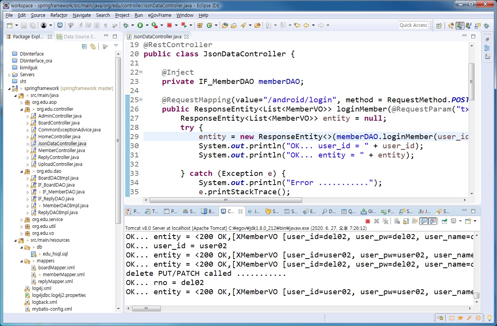
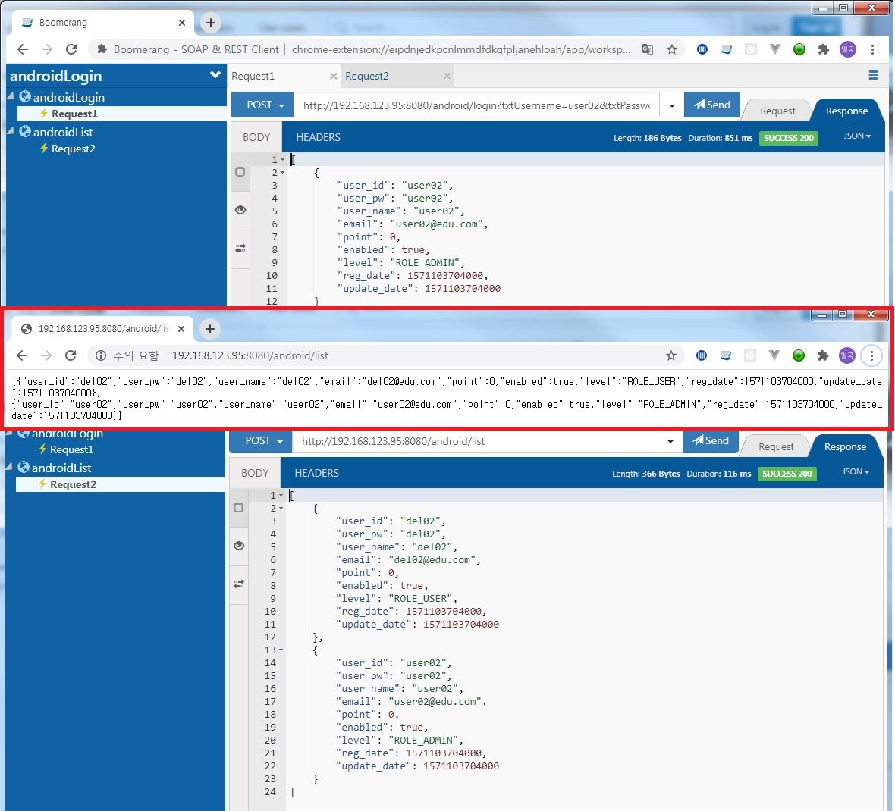
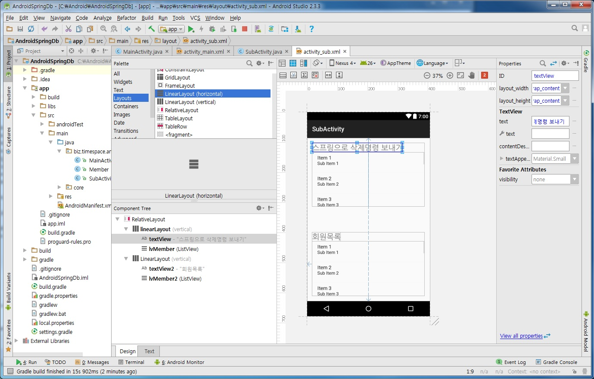
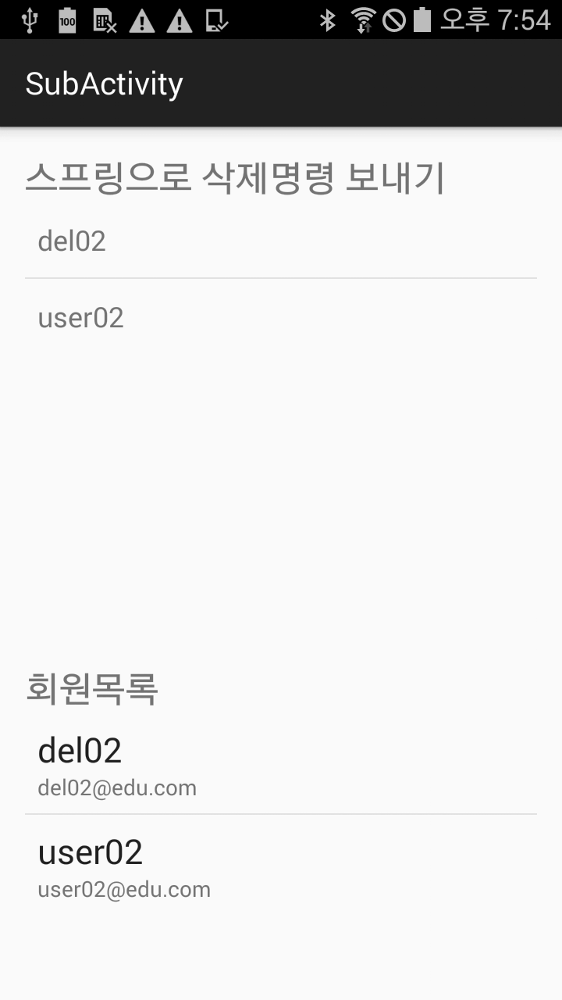
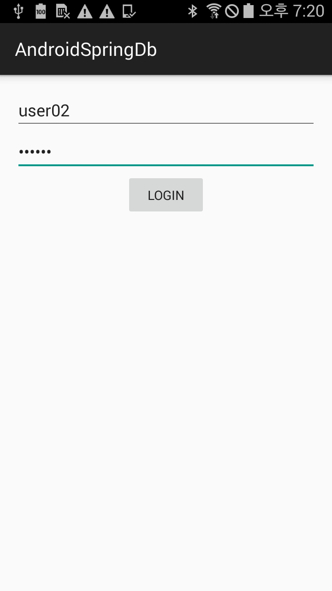

## 네트워크 프로그래밍 구현 (v16.0.0)
 
---

- [학습목차](https://github.com/miniplugin/human)
- 능력단위 요소: LM2001020508_14v2

---

### 학습목표(아래)

- 네트워크 프로그램을 구현하기 위한 네트워크 개발환경을 분석하고, 각 단계별로 요구되는 기능을 구현(코딩)하고, 테스트를 하는 능력과 프로그래밍 개발과정에서 발생할 수 있는 오류를 디버깅하여 프로그램을 최적화할 수 있다.

### 핵심키워드(아래)

- 네트워크 개발 환경분석, 네트워크 기능 구현, 네트워크 프로그램 디버깅, 네트워크 프로그램최적화, 형상관리, 네트워크 QoS(Quality of Service), 에이전트 소프트웨어, 소프트웨어 테스트, 네트워크 프로토콜, 네트워크 모델

### 개발환경 분석하기(기술 명세 검토 아래)

- 기존 스프링웹프로젝트에 RestController를 추가하여 DB와 연동시켜서 로그인과 회원 삭제를 처리하는 스마트폰앱 작성.(HelloWorld 프로젝트부터 시작)
- 안드로이드 스튜디오 IDE 개발툴 사용(세부명세는 AndroidManifest.xml 에 명시)
- uses-permission android:name="android.permission.INTERNET"

### 기능구현하기 + 프로그램 디버깅 + 최적화하기(애플리케이션제작 아래)

- 수행순서(아래)

```
1. 이전에 작업한 스프링MVC프로젝트에서 @RestController사용하여 스마트 폰(안드로이드)에서 사용할 JSON데이터를 생성 하는 클래스 작업.
2. 작성한 RESTFULL프로그램을 테스트하는 크롬 부메랑 츨러그인을 사용하여 제대로 실행되는지 확인하시오.
3. 안드로이드 스튜디오에서 로그인과 로그인 후 화면 UI를 제작하시오.
4. 안드로이드 스튜디오에서 JSON데이터를 받아서 로그인 처리하고, 파싱해서 로그인 후 화면에 회원정보를 LivsView로 구현하시오.
5. 스마트폰앱의 회원목록에서 회원을 삭제하는 기능을 추가하시오.
6. github에 저장소를 만들고 add, commit 및 push 명령어를 이용하여 저장소에 소스코드를 
   업로드하시오.
7. 안드로이드용 자원관리를 위한 HSQL 데이터베이스를 실행하고 캡쳐 하시오.
8. 효율적인 자원관리를 위하여 HSQL에이전트(Agent)를 설명하시오.(pom.xml 설정 설명)
9. 효과적인 트래픽 분석을 위하여 네트워크 QoS 를 안드로이드 스튜디오 모니터링 툴로 확인 하시오.
10. AdroidSpringDb 앱이 실행되는 결과를 캡쳐 하시오.
```

### JsonDataController.java 스프링 클래스 구현하기
```
package org.edu.controller;

import java.util.List;

import javax.inject.Inject;

import org.edu.vo.MemberVO;
import org.edu.dao.IF_MemberDAO;
import org.springframework.http.HttpStatus;
import org.springframework.http.ResponseEntity;
import org.springframework.web.bind.annotation.PathVariable;
import org.springframework.web.bind.annotation.RequestMapping;
import org.springframework.web.bind.annotation.RequestMethod;
import org.springframework.web.bind.annotation.RequestParam;
import org.springframework.web.bind.annotation.RestController;

@RestController
public class JsonDataController {

	@Inject
	private IF_MemberDAO memberDAO;
	
	@RequestMapping(value="/android/login", method = RequestMethod.POST) //안드로이드 외부로그인용
	public ResponseEntity<List<MemberVO>> loginMember(@RequestParam("txtUsername") String user_id,@RequestParam("txtPassword") String user_pw) {
		ResponseEntity<List<MemberVO>> entity = null;
		try {
			entity = new ResponseEntity<>(memberDAO.loginMember(user_id, user_pw), HttpStatus.OK);
			System.out.println("OK... user_id = " + user_id);
			System.out.println("OK... entity = " + entity);
		
		} catch (Exception e) {
			System.out.println("Error ...........");
			e.printStackTrace();
			entity = new ResponseEntity<>(HttpStatus.BAD_REQUEST);
		}	
		return entity;
		
	}
	
	@RequestMapping(value="/android/list", method = RequestMethod.POST) //안드로이드 외부로그인용
	public ResponseEntity<List<MemberVO>> androidMember() {
		ResponseEntity<List<MemberVO>> entity = null;
		try {
			entity = new ResponseEntity<>(memberDAO.androidMember(), HttpStatus.OK);
			System.out.println("OK... entity = " + entity);
		
		} catch (Exception e) {
			System.out.println("Error ...........");
			e.printStackTrace();
			entity = new ResponseEntity<>(HttpStatus.BAD_REQUEST);
		}	
		return entity;
		
	}
	
	@RequestMapping(value = "/android/delete/{user_id}", method = RequestMethod.POST)
	public ResponseEntity<String> deleteReply(@PathVariable("user_id") String user_id) {
	
		System.out.println("delete PUT/PATCH called ...........");
		ResponseEntity<String> entity = null;
		try {
			memberDAO.delete(user_id);
			System.out.println("OK... rno = " + user_id);
			entity = new ResponseEntity<String>("SUCCESS", HttpStatus.OK);
		} catch (Exception e) {
			System.out.println("Error ...........");
			e.printStackTrace();
			entity = new ResponseEntity<>(e.getMessage(), HttpStatus.BAD_REQUEST);
		}
		return entity;
	}
	
}
```

### 작업순서확인(아래)
- 캡쳐


- 안드로이드 앱 소스에 스프링의 VO같은 기능의 파일을 만들어서 SubActivity(자바)에서 xml(화면)과 데이터를 주고 받게 한다.(아래)

```
public class MemberVO {
    @SerializedName("user_id")//Json 데이터의 Key와 같은 명칭
    public String user_id;
    @SerializedName("user_name")//Json 데이터의 Key와 같은 명칭
    public String user_name;
    @SerializedName("email")//Json 데이터의 Key와 같은 명칭
    public String email;
    @SerializedName("levels")//Json 데이터의 Key와 같은 명칭
    public String levels;
}
```



- [앱프로그램소스 download this](git_img/AndroidSpringDb.zip)


### 참고자료 출처(아래)
- 학습모듈: https://ncs.go.kr/unity/th03/ncsSearchMain.do 20.정보통신 > 01.정보기술 > 02.정보기술개발 > 05.NW엔지니어링
- 교사자료: http://blog.daum.net/web_design/search/R&D%202016%20%ED%94%84%EB%A1%9C%EC%A0%9D%ED%8A%B83

- 개선하기(키패드로 인해 UI를 가리는 부분): https://superwony.tistory.com/4
- 최적화하기(채팅창스크롤): https://dev.re.kr/43
- 안드로이드프로젝트이름바꾸기: https://dotworks.tistory.com/4

================  아래 내용은 선택항목임. 여유 시간이 남는 학생만 하세요.  ===============

### 개발환경 분석하기(기술 명세 검토 아래)

- 채팅 서버/클라이언트 프로그램 작성.(HelloWorld 프로젝트부터 시작)
- 안드로이드 스튜디오 IDE 개발툴 사용(세부명세는 AndroidManifest.xml 에 명시)
- uses-permission android:name="android.permission.INTERNET"
- uses-permission android:name="android.permission.ACCESS_NETWORK_STATE"
- uses-permission android:name="android.permission.ACCESS_WIFI_STATE"

### 기능구현하기 + 프로그램 디버깅 + 최적화하기(애플리케이션제작 아래)

- 수행순서(아래)

```
1. 교사가 제시한 소스를 사용하여 스마트 폰(안드로이드)으로 서버 실행과 클라이언트 채팅이 가능하게 작업.
2. 작성한 프로그램을 테스트용 스마트폰에서 제대로 실행되는지 확인하시오.
3. EditText로 채팅내용을 입력 할때 키패드로 인해 UI를 가리는 부분을 개선하시오.
4. 키패드로 인해 UI를 가리는 부분 개선하시오.
5. 채팅 창의 스크롤이 글이 증가할때 자동으로 아래로 스크롤 되도록 개선하시오.
6.  github에 저장소를 만들고 add, commit 및 push 명령어를 이용하여 저장소에 소스코드를 
   업로드하시오.
7. 안드로이드용 자원관리를 위한 SQLite 데이터베이스에 대해 논하시오.
8. 효율적인 자원관리를 위하여 에이전트(Agent) 구현방안에 대해 논하시오.
9. 효과적인 트래픽 분석을 위하여 네트워크 QoS 제공방안에 대해 논하시오.
10. 디바이스 드라이브가 실행되는 결과를 캡쳐 하시오.
```

### 결과확인(아래)
- 캡쳐


- 아래 소스는 실제 수업시 내용 수정이 있습니다. 참조용으로만 보세요.
- [앱프로그램소스 download this](git_img/ChatApp.zip)

