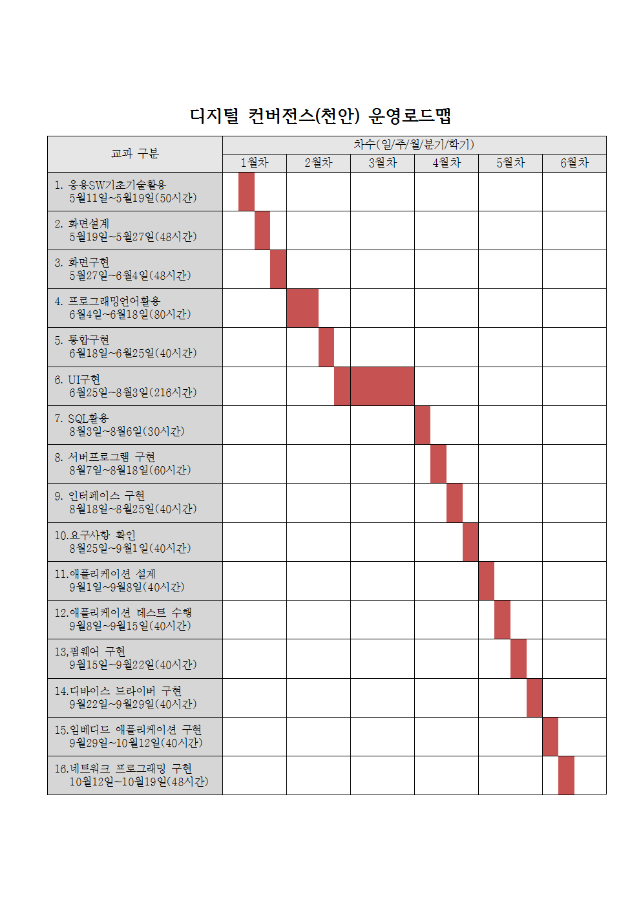

## 커리큘럼
 
---

- [학습목차](https://github.com/miniplugin/human)
- 학습목표
```
디지털 기술을 기반으로 다양한 기기의 융합, 콘텐츠의 융합을 통해 새로운 형태의 제품이나 융합서비스를 창출합니다.
기기/콘텐츠의 기획/설계/제작/운용/시험을 수행 할 수 있는 4차산업혁명의 핵심적인 과정을 습득합니다.
```
- [목차사용법]깃허브 태그[tag] 클릭, 예) [v1.0.0] <- 아래에서 해당부분 클릭하시면 해당과목으로 이동합니다.  

---

### [v1.0.0](https://github.com/miniplugin/human/tree/v1.0.0) 응용SW기초기술활용 (2001020216_15v3)

- 5월11일~5월19일(50시간) : 수준3 /사전평가(5월11일,1시간) /사후1차평가(5월19일,2시간) /사후2차평가(5월20일)
- 평가항목 : 사후 + 평가자체크리스트 + 서술형

### [v2.0.0](https://github.com/miniplugin/human/tree/v2.0.0) 화면설계 (2001020224_16v4)

- 5월19일~5월27일(48시간) : 수준5 /사전평가(5월19일,3시간) /사후1차평가(5월27일,2시간) /사후2차평가(5월28일)
- 평가항목 : 사후 + 포트폴리오

### [v3.0.0](https://github.com/miniplugin/human/tree/v3.0.0) 화면구현 (2001020225_16v4)

- 5월27일~6월4일(48시간) : 수준3 /사전평가(5월27일,3시간) /사후1차평가(6월4일,2시간) /사후2차평가(6월5일)
- 평가항목 : 사후 + 포트폴리오

### [v4.0.0](https://github.com/miniplugin/human/tree/v4.0.0) 프로그래밍언어활용 (2001020215_15v3)

- 6월4일~6월18일(80시간) : 수준3 /사전평가(6월4일,3시간) /사후1차평가(6월18일,2시간) /사후2차평가(6월19일)
- 평가항목 : 사후 + 문제해결시나리오

### [v5.0.0](https://github.com/miniplugin/human/tree/v5.0.0) 통합구현 (2001020206_16v4)

- 6월18일~6월25일(40시간) : 수준5 /사전평가(6월18일,3시간) /사후1차평가(6월25일,2시간) /사후2차평가(6월26일)
- 평가항목 : 사후 + 문제해결시나리오

### [v6.0.0](https://github.com/miniplugin/human/tree/v6.0.0) UI구현 (2001020708_17v2)

- 6월25일~8월3일(216시간) : 수준3 /사전평가(6월25일,3시간) /사후1차평가(8월3일,2시간) /사후2차평가(8월4일)
- 평가항목 : 사후 + 포트폴리오

### [v7.0.0](https://github.com/miniplugin/human/tree/v7.0.0) SQL활용 (2001020413_16v3)

- 8월3일~8월6일(30시간) :  수준3 /사전평가(8월3일,3시간) /사후1차평가(8월6일,8시간) /사후2차평가(8월7일)
- 평가항목 : 사후 + 문제해결시나리오 + 서술형

### [v8.0.0](https://github.com/miniplugin/human/tree/v8.0.0) 서버프로그램 구현 (2001020211_16v4)

- 8월7일~8월18일(60시간) : 수준5 /사전평가(8월7일,1시간) /사후1차평가(8월18일,4시간) /사후2차평가(8월19일)
- 평가항목 : 사후 + 포트폴리오

### [v9.0.0](https://github.com/miniplugin/human/tree/v9.0.0) 인터페이스 구현 (2001020212_16v4)

- 8월18일~8월25일(40시간) : 수준5 /사전평가(8월18일,5시간) /사후1차평가(8월24일,4시간) /사후2차평가(8월26일)
- 평가항목 : 사후 + 문제해결시나리오

### [v10.0.0](https://github.com/miniplugin/human/tree/v10.0.0) 요구사항 확인 (2001020201_16v3)

- 8월25일~9월1일(40시간) : 수준5 /사전평가(8월25일,5시간) /사후1차평가(9월1일,4시간) /사후2차평가(9월2일)
- 평가항목 : 사후 + 평가자체크리스트

### [v11.0.0](https://github.com/miniplugin/human/tree/v11.0.0) 애플리케이션 설계 (2001020221_16v4)

- 9월1일~9월8일(40시간) : 수준6 /사전평가(9월1일,5시간) /사후1차평가(9월8일,4시간) /사후2차평가(9월9일)
- 평가항목 : 사후 + 평가자체크리스트 + 서술형

### [v12.0.0](https://github.com/miniplugin/human/tree/v12.0.0) 애플리케이션 테스트 수행 (2001020227_16v4)

- 9월8일~9월15일(40시간) : 수준3 /사전평가(9월8일,5시간) /사후1차평가(9월15일,4시간) /사후2차평가(9월16일)
- 평가항목 : 사후 + 문제해결시나리오

### [v13.0.0](https://github.com/miniplugin/human/tree/v13.0.0) 펌웨어 구현 (2001020314_17v5)

- 9월15일~9월22일(40시간) : 수준5 /사전평가(9월15일,5시간) /사후1차평가(9월22일,4시간) /사후2차평가(9월23일)
- 평가항목 : 사후 + 문제해결시나리오

### [v14.0.0](https://github.com/miniplugin/human/tree/v14.0.0) 디바이스 드라이버 구현 (2001020320_17v5)

- 9월22일~9월29일(40시간) : 수준6 /사전평가(9월22일,5시간) /사후1차평가(9월29일,4시간) /사후2차평가(10월5일)
- 평가항목 : 사후 + 문제해결시나리오

### [v15.0.0](https://github.com/miniplugin/human/tree/v15.0.0) 임베디드 애플리케이션 구현 (2001020324_17v5)

- 9월29일~10월12일(40시간) : 수준5 /사전평가(9월29일,5시간) /사후1차평가(10월12일,4시간) /사후2차평가(10월13일)
- 평가항목 : 사후 + 포트폴리오

### [v16.0.0](https://github.com/miniplugin/human/tree/v16.0.0) 네트워크 프로그래밍 구현 (2001020508_14v2)

- 10월12일~10월19일(48시간) : 수준3 /사전평가(10월12일,5시간) /사후1차평가(10월19일,8시간) /사후2차평가(10월20일)
- 평가항목 : 사후 + 포트폴리오
