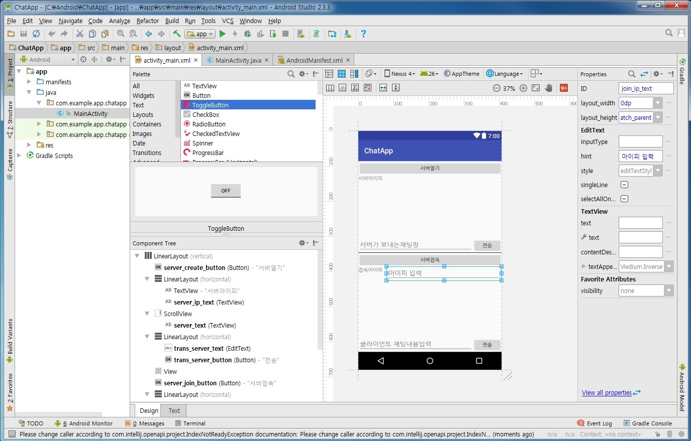
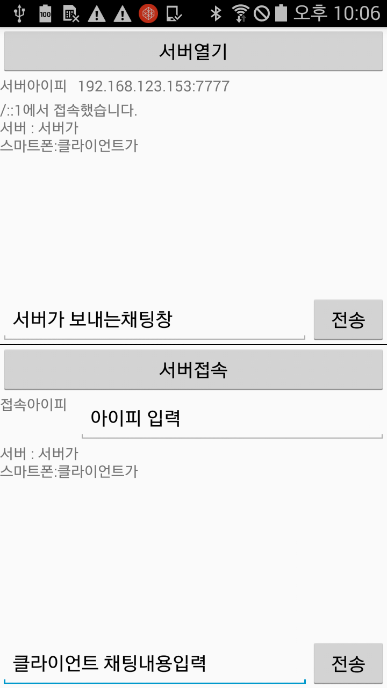

## 네트워크 프로그래밍 구현 (v16.0.0)
 
---

- [학습목차](https://github.com/miniplugin/human)
- 능력단위 요소: LM2001020508_14v2

---

### 학습목표(아래)

- 네트워크 프로그램을 구현하기 위한 네트워크 개발환경을 분석하고, 각 단계별로 요구되는 기능을 구현(코딩)하고, 테스트를 하는 능력과 프로그래밍 개발과정에서 발생할 수 있는 오류를 디버깅하여 프로그램을 최적화할 수 있다.

### 핵심키워드(아래)

- 네트워크 개발 환경분석, 네트워크 기능 구현, 네트워크 프로그램 디버깅, 네트워크 프로그램최적화, 형상관리, 네트워크 QoS(Quality of Service), 에이전트 소프트웨어, 소프트웨어 테스트, 네트워크 프로토콜, 네트워크 모델

### 개발환경 분석하기(기술 명세 검토 아래)

- 채팅 서버/클라이언트 프로그램 작성.(HelloWorld 프로젝트부터 시작)
- 안드로이드 스튜디오 IDE 개발툴 사용(세부명세는 AndroidManifest.xml 에 명시)
- uses-permission android:name="android.permission.INTERNET"
- uses-permission android:name="android.permission.ACCESS_NETWORK_STATE"
- uses-permission android:name="android.permission.ACCESS_WIFI_STATE"

### 기능구현하기 + 프로그램 디버깅 + 최적화하기(애플리케이션제작 아래)

- 수행순서(아래)

```
1. 교사가 제시한 소스를 사용하여 스마트 폰(안드로이드)으로 서버 실행과 클라이언트 채팅이 가능하게 작업.
2. 작성한 프로그램을 테스트용 스마트폰에서 제대로 실행되는지 확인하시오.
3. EditText로 채팅내용을 입력 할때 키패드로 인해 UI를 가리는 부분을 개선하시오.
4. 키패드로 인해 UI를 가리는 부분 개선하시오.
5. 채팅 창의 스크롤이 글이 증가할때 자동으로 아래로 스크롤 되도록 개선하시오.
6.  github에 저장소를 만들고 add, commit 및 push 명령어를 이용하여 저장소에 소스코드를 
   업로드하시오.
7. 안드로이드용 자원관리를 위한 SQLite 데이터베이스에 대해 논하시오.
8. 효율적인 자원관리를 위하여 에이전트(Agent) 구현방안에 대해 논하시오.
9. 효과적인 트래픽 분석을 위하여 네트워크 QoS 제공방안에 대해 논하시오.
10. 디바이스 드라이브가 실행되는 결과를 캡쳐 하시오.
```

### 결과확인(아래)
- 캡쳐


- [앱프로그램소스 download this](git_img/ChatApp.zip)

### 참고자료 출처(아래)
- 학습모듈: https://ncs.go.kr/unity/th03/ncsSearchMain.do 20.정보통신 > 01.정보기술 > 02.정보기술개발 > 05.NW엔지니어링
- 개선하기(키패드로 인해 UI를 가리는 부분): https://superwony.tistory.com/4
- 최적화하기(채팅창스크롤): https://dev.re.kr/43
