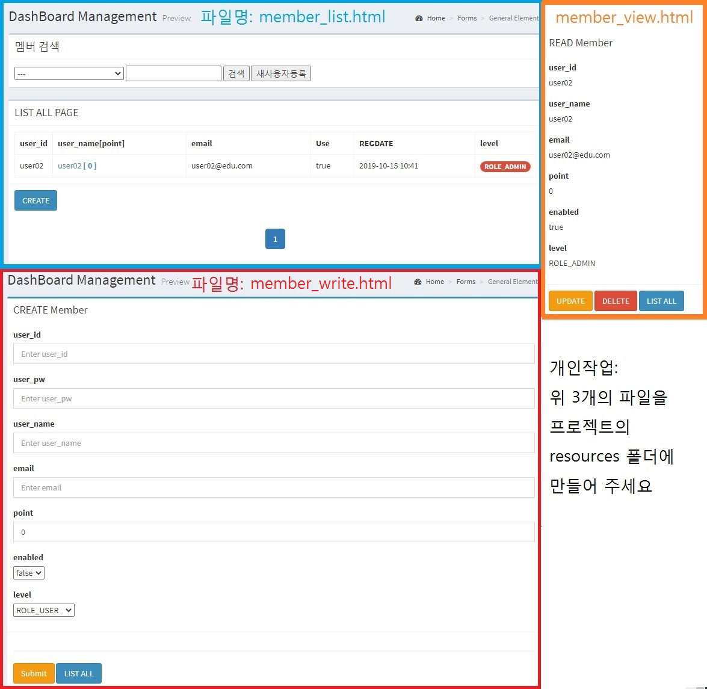

## UI구현 (v6.0.0)
 
---

- [학습목차](https://github.com/miniplugin/human)
- 능력단위 요소: 2001020708_17v2

---

### 학습목표(아래)
- UI 설계 산출물과 GUI 디자인 가이드를 바탕으로 UI 구현표준을 수립하고 UI를 제작할 수 있다.

### 핵심키워드(아래)
- 사용자 중심 인터랙션 디자인(human computer interaction design), html(hyper text markup
language), web, app, css(cascading style sheets), gui(graphic user interface), layout, font,
header, container, footer, color, UI 설계 검토, UI 구현 표준, UI 저작도구, 프로토타입 UI, 단위
테스트, 테스트 케이스

### UI 디자인 가이드 이해(아래)
- 교사가 제시한 나라장터의 제안요청서 파일 검토(아래URL).
- http://www.g2b.go.kr/pt/menu/selectSubFrame.do?framesrc=http://www.g2b.go.kr:8340/search.do?category=TGONG&kwd=%C0%CF%C7%D0%BD%C0%BA%B4%C7%E0%C1%A6
- 기타 교사가 제시한 디자인 제안서 2가지 확인(구글드라이브) 

### UI 구현 표준 검토하기(아래)
- 교사가 제시한 UI디자인 & Development개발 가이드 파일 검토(아래URL).
- https://drive.google.com/file/d/1JsAIwUItL2phlsXEwQ7yK-BOA7mbizJ-/view?usp=sharing

### UI 저작도구 활용하기(아래)
- 교사가 제시한 UI디자인 & Development개발 가이드를 적용할 Home사용자페이지 다운로드 합니다(아래 소스 다운로드).
- 소스: [download this](git_img/home.zip) 다운로드 후 압축을 풀고 webapp/resources 폴더에 넣어 줍니다. 
- 교사가 제시한 Admin관리자페이지는  부트스트랩기반 반응형 Admin-LTE free템플릿 사용(아래 URL).
- URL: https://adminlte.io/ (메인페이지에서 DOWNLOAD 버튼 사용 또는 깃에서 다운로드 https://github.com/ColorlibHQ/AdminLTE )
- Admin-LTE 다운로드 받은 것을 압축풀고 webapp/resources 폴더에 넣어 줍니다.
- 교사가 제시한 부트스트랩 디자인 프레임웍을 다운로드합니다(아래 소스 다운로드).
- 소스: [download this](git_img/bootstrap.zip) 다운로드 후 압축을 풀고 webapp/resources 폴더에 넣어 줍니다.

### UI 제작하기(아래)
- 위에서 교사가 제시한 UI디자인 & Development개발 가이드 파일 검토 후 스프링 MVC웹프로젝트에 제작(퍼블리싱)한다. 
- 교사가 제시한 단위테스트 사항들을 크롬웹브라우저에서 수행한다.

### 참고자료 출처(아래)
- 위에 사용된 소프트웨어는 자유SW 또는 GNU / LGPL / MIT license 입니다.
- 위 작업시 사용된 이미지는 픽사베이 무료이미지만 사용한다 : https://pixabay.com/
- 20200623 메뉴선택시 선택부분만 활성화: 자바스크립트(JQuery)로 처리-학생실습(아래)

```
<!-- footer.jsp 하단에 저장 : 아래 [클래스명을입력]부분을 학생이 채우세요... -->
<script>
$(document).ready(function() {
    var current = location.pathname;
    $('클래스명을입력 li a').each(function(){
        var $this = $(this);
        if($this.attr('href').includes(current) == true){
            $this.addClass('active');
        }else{
        	$this.removeClass('active');
        }
    })
 });
</script>
```

- 관리자페이지 중 회원관리 페이지 제작예시(아래)

- 관리자페이지 중 게시판관리 페이지 제작예시(아래)


### JQuery 연습(아래)

<h3>1. jQuery 개요</h3>

<p>&nbsp; -개요 : 자바 스크립트 라이브러리 중 대표적임.</p>

<p>&nbsp;- DOM엘리먼트 하나하나 접근하여 작업을 수행</p>

<p>&nbsp;&nbsp;&nbsp;&nbsp;-페이지에 강력한 CSS를 추가</p>

<p>&nbsp; &nbsp; -엘리먼트 속성 변경, 엘리먼트를 추가</p>


<p>&nbsp; -특징 : DOM 엘리먼트셀렉터(DOM: HTML, XML을 제어)</p>

<p>&nbsp;html태그선택&nbsp;: $(&quot;a&quot;),$(&quot;div&quot;)</p>

<p>&nbsp;CSS클래스선택 : $(&quot;.클래스명&quot;), $(&quot;태그, 클래스명&quot;)</p>

<p>&nbsp;CSS ID선택&nbsp;: $(&quot;#id&quot;) --&gt; document.getElementById(&quot;id&quot;)와 같다</p>

<p>&nbsp;중첩구조 : $(&quot;#id&quot;).find(&quot;li&quot;) =&gt; $(&quot;#id li&quot;)</p>

<p><span style="-webkit-font-smoothing: subpixel-antialiased; font-family: Verdana; font-size: 14pt;">&nbsp;jquery 사용법 시작부분</span></p>


<div class="code notranslate" style="-webkit-font-smoothing: subpixel-antialiased; font-variant-numeric: normal; font-variant-east-asian: normal; font-stretch: normal; font-size: 12px; line-height: normal; font-family: verdana, helvetica, arial, sans-serif; border-width: 1px; border-style: solid; border-color: rgb(212, 212, 212); padding: 5px; background-color: rgb(229, 238, 204); margin: 0px; width: 622px; text-size-adjust: auto;">
<div style="-webkit-font-smoothing: subpixel-antialiased; border-width: 1px; border-style: solid; border-color: rgb(212, 212, 212); padding: 4px; background-color: rgb(255, 255, 255); width: 612px; font-family: &quot;courier new&quot;; font-size: 13px;">&lt;script type=&quot;text/javascript&quot; src=&quot;jquery.js&quot;&gt;&lt;/script&gt;</div>
</div>

<p style="-webkit-font-smoothing: subpixel-antialiased; font-variant-numeric: normal; font-variant-east-asian: normal; font-stretch: normal; font-size: 12px; line-height: normal; font-family: verdana, helvetica, arial, sans-serif; background-color: rgb(249, 249, 249); text-size-adjust: auto;">&lt;head&gt; 태그 안쪽에 사용 &lt;/head&gt;</p>

<p><br style="-webkit-font-smoothing: subpixel-antialiased;" />
&nbsp;-Ajax 지원 (현재 진행중인 스프링프로젝트 댓글 기능에 사용할 예정)</p>

<p>&nbsp;-사용법(아래)</p>

<p>&nbsp;*$(document).ready(callback)</p>

<p>&nbsp; &nbsp;단축형:&nbsp;jQuery(callback)/$(callback)&nbsp;</p>

<p>&nbsp; $(document).ready(function(){</p>

<p>&nbsp; &nbsp;//사용자 소스 영역</p>

<p>&nbsp; });</p>


<p>&nbsp; $(function() {</p>

<p>&nbsp;&nbsp;//사용자 소스 영역</p>

<p>&nbsp; });</p>

<p>&nbsp; jQuery(document).ready(function() {</p>

<p>&nbsp;&nbsp;//사용자 소스 영역</p>

<p>&nbsp; });</p>

<p>&nbsp; jQuery(function() {</p>

<p>&nbsp;&nbsp;//사용자 소스 영역</p>

<p>&nbsp; });</p>

<h3><span style="-webkit-font-smoothing: subpixel-antialiased; font-family: Verdana; font-size: 14pt;">2. Core</span></h3>

<p>&nbsp; -jquery의 핵심이 되는것을 의미한다 core를 표현하면 &#39;$()&#39; 이렇게 된다</p>

<h3>&nbsp; 1) jQuery( expression, context )</h3>

<p>&nbsp; &nbsp; &nbsp;expression는 String로 표현되고 특정 태그를 찾을때 사용되며, context는 Element나 jQuery으로 인자 값으로 받는다.</p>

<p>&nbsp; &nbsp; &nbsp;즉, $(&quot;input:radio&quot;, document.forms[0]); 이와 같이 사용된다. ==&nbsp;<code style="margin: 0px; padding: 0px; border: 0px; font-style: inherit; font-variant: inherit; font-weight: inherit; font-stretch: inherit; line-height: inherit; font-family: Consolas, Menlo, Monaco, &quot;Lucida Console&quot;, &quot;Liberation Mono&quot;, &quot;DejaVu Sans Mono&quot;, &quot;Bitstream Vera Sans Mono&quot;, &quot;Courier New&quot;, monospace, sans-serif; vertical-align: baseline; box-sizing: inherit; white-space: inherit;"><span class="pln" style="margin: 0px; padding: 0px; border: 0px; font-style: inherit; font-variant: inherit; font-weight: inherit; font-stretch: inherit; line-height: inherit; font-family: inherit; vertical-align: baseline; box-sizing: inherit; color: var(--black-750);">$</span><span class="pun" style="margin: 0px; padding: 0px; border: 0px; font-style: inherit; font-variant: inherit; font-weight: inherit; font-stretch: inherit; line-height: inherit; font-family: inherit; vertical-align: baseline; box-sizing: inherit; color: var(--black-750);">(</span><span class="str" style="margin: 0px; padding: 0px; border: 0px; font-style: inherit; font-variant: inherit; font-weight: inherit; font-stretch: inherit; line-height: inherit; font-family: inherit; vertical-align: baseline; box-sizing: inherit; color: var(--red-800);">&#39;</span></code>document.forms[0]<code style="margin: 0px; padding: 0px; border: 0px; font-style: inherit; font-variant: inherit; font-weight: inherit; font-stretch: inherit; line-height: inherit; font-family: Consolas, Menlo, Monaco, &quot;Lucida Console&quot;, &quot;Liberation Mono&quot;, &quot;DejaVu Sans Mono&quot;, &quot;Bitstream Vera Sans Mono&quot;, &quot;Courier New&quot;, monospace, sans-serif; vertical-align: baseline; box-sizing: inherit; white-space: inherit;"><span class="str" style="margin: 0px; padding: 0px; border: 0px; font-style: inherit; font-variant: inherit; font-weight: inherit; font-stretch: inherit; line-height: inherit; font-family: inherit; vertical-align: baseline; box-sizing: inherit; color: var(--red-800);">&#39;</span><span class="pun" style="margin: 0px; padding: 0px; border: 0px; font-style: inherit; font-variant: inherit; font-weight: inherit; font-stretch: inherit; line-height: inherit; font-family: inherit; vertical-align: baseline; box-sizing: inherit; color: var(--black-750);">).</span><span class="pln" style="margin: 0px; padding: 0px; border: 0px; font-style: inherit; font-variant: inherit; font-weight: inherit; font-stretch: inherit; line-height: inherit; font-family: inherit; vertical-align: baseline; box-sizing: inherit; color: var(--black-750);">find</span><span class="pun" style="margin: 0px; padding: 0px; border: 0px; font-style: inherit; font-variant: inherit; font-weight: inherit; font-stretch: inherit; line-height: inherit; font-family: inherit; vertical-align: baseline; box-sizing: inherit; color: var(--black-750);">(</span><span class="str" style="margin: 0px; padding: 0px; border: 0px; font-style: inherit; font-variant: inherit; font-weight: inherit; font-stretch: inherit; line-height: inherit; font-family: inherit; vertical-align: baseline; box-sizing: inherit; color: var(--red-800);">&#39;input:radio&#39;</span><span class="pun" style="margin: 0px; padding: 0px; border: 0px; font-style: inherit; font-variant: inherit; font-weight: inherit; font-stretch: inherit; line-height: inherit; font-family: inherit; vertical-align: baseline; box-sizing: inherit; color: var(--black-750);">)</span></code></p>

<h3>&nbsp; 2) jQuery( html )</h3>

<p>&nbsp; &nbsp; &nbsp;jQuery는 인자값으로 html 태그를 받아 그 태그를 HTML페이지에 추가를 할 수가 있다.</p>

<p>&nbsp; &nbsp; &nbsp;즉, 이렇게 $(&quot;&lt;div&gt;&lt;p&gt;제이쿼리&lt;/p&gt;&lt;/div&gt;&quot;).appendTo(&quot;body&quot;) 사용이 되기도 하고, &nbsp;</p>

<p>&nbsp; &nbsp; &nbsp;$(&quot;&lt;input/&gt;&quot;).attr(&quot;type&quot;, &quot;checkbox&quot;); 이렇게 사용되기도 한다</p>

<h3>&nbsp; 3) jQuery( elements )</h3>

<p>&nbsp; &nbsp; &nbsp;DOM element(s) 를 인자로 받아 그 지역의 elements를 설정할 수가 있다.(한개 혹은 다수를 지정할 수가 있다.)</p>

<p>&nbsp; &nbsp; &nbsp;$(document.body).css( &quot;background&quot;, &quot;black&quot; ); -&gt; HTML 배경색을 검정색으로 바꾼다.</p>

<p>&nbsp; &nbsp; &nbsp;$(myForm.elements).hide() -&gt; myForm의 이름을 가진 form안의 elements을 숨긴다.</p>

<h3>&nbsp; 4) jQuery( callback ) 인자값을 함수로 지정을 할 수가 있다</h3>

<p>&nbsp; &nbsp; &nbsp;&quot;$(document).ready(function(){....};)&quot;</p>

<p>&nbsp; 5) each( callback ) 해당 오브젝트에서 어떤 함수처리를 하고 싶을 경우 사용된다</p>

<p>&nbsp; &nbsp; &nbsp;$(function() {</p>

<p>&nbsp; &nbsp; &nbsp; &nbsp; $(document.body).click(function(){</p>

<p>&nbsp; &nbsp; &nbsp; &nbsp; &nbsp; &nbsp; $(&quot;div&quot;).each(function(args) {</p>

<p>&nbsp; &nbsp; &nbsp; &nbsp; &nbsp; &nbsp; &nbsp;//....</p>

<p>&nbsp; &nbsp; &nbsp; &nbsp; &nbsp; &nbsp; });</p>

<p>&nbsp; &nbsp; &nbsp; &nbsp; });</p>

<p>&nbsp; &nbsp;});</p>

<h3>&nbsp; 6) size() 해당 오브젝트의 Elements의 수를 알고자 할 때 사용된다.</h3>

<p>&nbsp; &nbsp; &nbsp;$(document.body).click(function () {</p>

<p>&nbsp; &nbsp; &nbsp; &nbsp; $(document.body).append($(&quot;&lt;div&gt;&quot;));</p>

<p>&nbsp; &nbsp; &nbsp; &nbsp; var n = $(&quot;div&quot;).size();</p>

<p>&nbsp; &nbsp; &nbsp; &nbsp; $(&quot;span&quot;).text(&quot;There are &quot; + n + &quot; divs.&quot; + &quot;Click to add more.&quot;);</p>

<p>&nbsp; &nbsp; }).click(); // trigger the click to start</p>

<p><br style="-webkit-font-smoothing: subpixel-antialiased;" />
&nbsp; 7) length() 해당 오브젝트의 Elements의 수를 알고자 할 때 사용된다. size()와 동일하다.</p>

<p>&nbsp; &nbsp; &nbsp; $(document.body).click(function () {</p>

<p>&nbsp; &nbsp; &nbsp; &nbsp; &nbsp; &nbsp;$(document.body).append($(&quot;&lt;div&gt;&quot;));</p>

<p>&nbsp; &nbsp; &nbsp; &nbsp; &nbsp; &nbsp;var n = $(&quot;div&quot;).length;</p>

<p>&nbsp; &nbsp; &nbsp; &nbsp; &nbsp; &nbsp;$(&quot;span&quot;).text(&quot;There are &quot; + n + &quot; divs.&quot; + &quot;Click to add more.&quot;);</p>

<p>&nbsp; &nbsp; &nbsp; }).trigger(&#39;click&#39;); // trigger the click to start</p>

<h3>&nbsp; 8) get()해당 태그의 Elements 들을 Array형태로 리턴한다. 즉, &#39;$(&quot;div&quot;).get()&#39; 하면 모든 div태그 들을 Array 형태로 리턴한다.</h3>

<p>&nbsp; &nbsp; &nbsp;한마디로 하면 DOM의 Elements를 배열로 리턴하는 것이다</p>

<p>&nbsp; &nbsp; &nbsp; function disp(divs) {</p>

<p>&nbsp; &nbsp; &nbsp; &nbsp; &nbsp; var a = [];</p>

<p>&nbsp; &nbsp; &nbsp; &nbsp; &nbsp; for (var i = 0; i &lt; divs.length; i++) {</p>

<p>&nbsp; &nbsp; &nbsp; &nbsp; &nbsp; &nbsp; &nbsp; &nbsp;a.push(divs[i].innerHTML);</p>

<p>&nbsp; &nbsp; &nbsp; &nbsp; &nbsp; }</p>

<p>&nbsp; &nbsp; &nbsp; &nbsp; &nbsp; $(&quot;span&quot;).text(a.join(&quot; &quot;));</p>

<p>&nbsp; &nbsp; &nbsp; }</p>

<p>&nbsp; &nbsp; &nbsp; disp( $(&quot;div&quot;).get().reverse() ); // div태그의 값들을 읽어 와서 그 값의 순서를 뒤집는다.</p>

<h2 style="-webkit-font-smoothing: subpixel-antialiased; font-variant-numeric: normal; font-variant-east-asian: normal; font-weight: normal; font-stretch: normal; font-size: 19px; line-height: normal; font-family: verdana, helvetica, arial, sans-serif; margin-top: 10px; margin-bottom: 10px; text-size-adjust: auto;"></h2>

<h2 style="-webkit-font-smoothing: subpixel-antialiased; font-variant-numeric: normal; font-variant-east-asian: normal; font-weight: normal; font-stretch: normal; font-size: 19px; line-height: normal; font-family: verdana, helvetica, arial, sans-serif; margin-top: 10px; margin-bottom: 10px; text-size-adjust: auto;">3. Selectors(선택자)</h2>

<table class="reference" style="border-style: solid; border-color: rgb(195, 195, 195); -webkit-font-smoothing: subpixel-antialiased; background-color: rgb(255, 255, 255); width: 633px; border-collapse: collapse; font-variant-numeric: normal; font-variant-east-asian: normal; font-stretch: normal; font-size: 12px; line-height: normal; font-family: verdana, helvetica, arial, sans-serif; text-size-adjust: auto;">
	<tbody style="-webkit-font-smoothing: subpixel-antialiased;">
		<tr style="-webkit-font-smoothing: subpixel-antialiased;">
			<th align="left" style="border-style: solid; border-color: rgb(195, 195, 195); -webkit-font-smoothing: subpixel-antialiased; text-align: left; padding: 3px; background-color: rgb(229, 238, 204); vertical-align: top;" width="25%">Syntax</th>
			<th align="left" style="border-style: solid; border-color: rgb(195, 195, 195); -webkit-font-smoothing: subpixel-antialiased; text-align: left; padding: 3px; background-color: rgb(229, 238, 204); vertical-align: top;" width="75%">Description</th>
		</tr>
		<tr style="-webkit-font-smoothing: subpixel-antialiased;">
			<td style="border-style: solid; border-color: rgb(195, 195, 195); -webkit-font-smoothing: subpixel-antialiased; padding: 3px; vertical-align: top;">$(this)</td>
			<td style="border-style: solid; border-color: rgb(195, 195, 195); -webkit-font-smoothing: subpixel-antialiased; padding: 3px; vertical-align: top;">Selects the current HTML element</td>
		</tr>
		<tr style="-webkit-font-smoothing: subpixel-antialiased;">
			<td style="border-style: solid; border-color: rgb(195, 195, 195); -webkit-font-smoothing: subpixel-antialiased; padding: 3px; vertical-align: top;">$(&quot;p:first&quot;)</td>
			<td style="border-style: solid; border-color: rgb(195, 195, 195); -webkit-font-smoothing: subpixel-antialiased; padding: 3px; vertical-align: top;">Selects the first &lt;p&gt; element</td>
		</tr>
		<tr style="-webkit-font-smoothing: subpixel-antialiased;">
			<td style="border-style: solid; border-color: rgb(195, 195, 195); -webkit-font-smoothing: subpixel-antialiased; padding: 3px; vertical-align: top;">$(&quot;.intro&quot;)</td>
			<td style="border-style: solid; border-color: rgb(195, 195, 195); -webkit-font-smoothing: subpixel-antialiased; padding: 3px; vertical-align: top;">Selects all elements with class=&quot;intro&quot;</td>
		</tr>
		<tr style="-webkit-font-smoothing: subpixel-antialiased;">
			<td style="border-style: solid; border-color: rgb(195, 195, 195); -webkit-font-smoothing: subpixel-antialiased; padding: 3px; vertical-align: top;">$(&quot;#intro&quot;)</td>
			<td style="border-style: solid; border-color: rgb(195, 195, 195); -webkit-font-smoothing: subpixel-antialiased; padding: 3px; vertical-align: top;">Selects the first element with id=&quot;intro&quot;</td>
		</tr>
		<tr style="-webkit-font-smoothing: subpixel-antialiased;">
			<td style="border-style: solid; border-color: rgb(195, 195, 195); -webkit-font-smoothing: subpixel-antialiased; padding: 3px; vertical-align: top;">$(&quot;ul li:first&quot;)</td>
			<td style="border-style: solid; border-color: rgb(195, 195, 195); -webkit-font-smoothing: subpixel-antialiased; padding: 3px; vertical-align: top;">Selects the first &lt;li&gt; element of the first &lt;ul&gt;</td>
		</tr>
		<tr style="-webkit-font-smoothing: subpixel-antialiased;">
			<td style="border-style: solid; border-color: rgb(195, 195, 195); -webkit-font-smoothing: subpixel-antialiased; padding: 3px; vertical-align: top;">$(&quot;ul li:first-child&quot;)</td>
			<td style="border-style: solid; border-color: rgb(195, 195, 195); -webkit-font-smoothing: subpixel-antialiased; padding: 3px; vertical-align: top;">Selects the first &lt;li&gt; element of every &lt;ul&gt;</td>
		</tr>
		<tr style="-webkit-font-smoothing: subpixel-antialiased;">
			<td style="border-style: solid; border-color: rgb(195, 195, 195); -webkit-font-smoothing: subpixel-antialiased; padding: 3px; vertical-align: top;">$(&quot;[href]&quot;)</td>
			<td style="border-style: solid; border-color: rgb(195, 195, 195); -webkit-font-smoothing: subpixel-antialiased; padding: 3px; vertical-align: top;">Selects all elements with an href attribute</td>
		</tr>
		<tr style="-webkit-font-smoothing: subpixel-antialiased;">
			<td style="border-style: solid; border-color: rgb(195, 195, 195); -webkit-font-smoothing: subpixel-antialiased; padding: 3px; vertical-align: top;">$(&quot;[href$=&#39;.jpg&#39;]&quot;)</td>
			<td style="border-style: solid; border-color: rgb(195, 195, 195); -webkit-font-smoothing: subpixel-antialiased; padding: 3px; vertical-align: top;">Selects all elements with an href attribute that ends with &quot;.jpg&quot;</td>
		</tr>
		<tr style="-webkit-font-smoothing: subpixel-antialiased;">
			<td style="border-style: solid; border-color: rgb(195, 195, 195); -webkit-font-smoothing: subpixel-antialiased; padding: 3px; vertical-align: top;">$(&quot;[href=&#39;#&#39;]&quot;)</td>
			<td style="border-style: solid; border-color: rgb(195, 195, 195); -webkit-font-smoothing: subpixel-antialiased; padding: 3px; vertical-align: top;">Selects all elements with an href value equal to &quot;#&quot;</td>
		</tr>
		<tr style="-webkit-font-smoothing: subpixel-antialiased;">
			<td style="border-style: solid; border-color: rgb(195, 195, 195); -webkit-font-smoothing: subpixel-antialiased; padding: 3px; vertical-align: top;">$(&quot;[href!=&#39;#&#39;]&quot;)</td>
			<td style="border-style: solid; border-color: rgb(195, 195, 195); -webkit-font-smoothing: subpixel-antialiased; padding: 3px; vertical-align: top;">Selects all elements with an href value NOT equal to &quot;#&quot;</td>
		</tr>
		<tr style="-webkit-font-smoothing: subpixel-antialiased;">
			<td style="border-style: solid; border-color: rgb(195, 195, 195); -webkit-font-smoothing: subpixel-antialiased; padding: 3px; vertical-align: top;">$(&quot;div#intro .head&quot;)</td>
			<td style="border-style: solid; border-color: rgb(195, 195, 195); -webkit-font-smoothing: subpixel-antialiased; padding: 3px; vertical-align: top;">Selects all elements with class=&quot;head&quot; inside a &lt;div&gt; element with id=&quot;intro&quot;</td>
		</tr>
	</tbody>
</table>

<p>//CSS ID</p>

<p>$(&quot;#div1&quot;).css(&quot;border&quot;, &quot;3px solid red&quot;);</p>

<p></p>

<p>//태그 element</p>

<p>$(&quot;p&quot;).css(&quot;color&quot;,&quot;blue&quot;);</p>

<p>//CSS class</p>

<p>$(&quot;.test&quot;).css(&quot;color&quot;, &quot;green&quot;);</p>

<p>//*: 모든요소</p>

<p>$(&quot;*&quot;).css(&quot;font-size&quot;, &quot;15pt&quot;);</p>

<p>//계층적(조상 -&nbsp;모든 자손)</p>

<p>$(&quot;form input&quot;).css(&quot;border&quot;, &quot;2px solid blue&quot;);</p>

<p>//계층적(조상의 1단계 자손만)</p>

<p>$(&quot;#main &gt; *&quot;).css(&quot;border&quot;, &quot;3px double red&quot;);</p>

<p>E 태그명이 E인 요소(예를 들면 게시판의&nbsp;tr태그)</p>

<p>E:nth-child(n) 부모 요소를 기준으로 n번째 위치한 요소</p>

<p>E:first-child 부모 요소를 기준으로 첫번째 위차한 요소</p>

<p>E:last-child 부모 요소를 기준으로 마지막에 위치한 요소</p>

<p>E:checked checked 속성을 갖는 요소.</p>

<p>E:selected selected 속성을 갖는 요소</p>

<p>E:even 짝수 번째인 요소를</p>

<p>$(&quot;tr:even&quot;).css(&quot;background&quot;, &quot;#00FF00&quot;);</p>

<p>:odd 홀수 번째인 요소를</p>

<p>$(&quot;tr:odd&quot;).css(&quot;background&quot;, &quot;#FF0000&quot;);</p>

<p>:eq(n) 또는 :nth(n) n번째에 해당하는 요소</p>

<p>$(&quot;tr:eq(2)&quot;).css(&quot;color&quot;, &quot;silver&quot;);</p>

<p>:gt(n) n+1번째 보다 큰 요소</p>

<p>$(&quot;tr:gt(3)&quot;).css(&quot;color&quot;, &quot;red&quot;);</p>

<p>:lt(n) n+1번째 보다 작은 요소</p>

<p>:first 또는 :eq(0) 첫번째 요소</p>

<p>$(&quot;tr:first&quot;).css(&quot;background&quot;, &quot;#FFFF00&quot;).css(&quot;color&quot;, &quot;blue&quot;);</p>

<p>:last 마지막 요소</p>

<p>$(&quot;tr:last&quot;).css(&quot;background&quot;, &quot;#00FFFF&quot;);</p>

<p>:parent 대상 요소의 부모 요소</p>

<p>:contains(&#39;문자열&#39;) text 노드값에 &#39;문자열&#39;을 포함하는 요소</p>

<p>$(&quot;tr:contains(&#39;홍&#39;)&quot;).css(&quot;border&quot;, &quot;solid 3px green&quot;);</p>

<p><span style="-webkit-font-smoothing: subpixel-antialiased; font-family: Verdana; font-size: 14pt;">4. Attributes(속성)</span></p>

<p>$(&quot;#btn2&quot;).click(function(){ &nbsp;// 속성 확인하기&nbsp;</p>

<p>&nbsp; &nbsp; var str=$(&quot;#name&quot;).attr(&quot;type&quot;);</p>

<p>&nbsp; &nbsp; alert(str);</p>

<p>});</p>

<p></p>

<p>$(&quot;#btn3&quot;).click(function(){ &nbsp;// 속성 추가하기</p>

<p>&nbsp; &nbsp; $(&quot;#name&quot;).attr(&quot;disabled&quot;,&quot;disabled&quot;); //버튼을 클릭하면 변경불가속성 추가...</p>

<p>});</p>

<p></p>

<p>$(&quot;#btn4&quot;).click(function(){ &nbsp;// 속성 삭제하기</p>

<p>&nbsp; &nbsp; $(&quot;#name&quot;).removeAttr(&quot;disabled&quot;);</p>

<p>});</p>

<p>$(&quot;#btn5&quot;).click(function(){ &nbsp;</p>

<p>&nbsp; &nbsp; $(&quot;p:even&quot;).removeClass(&quot;blue&quot;);&nbsp;//짝수번째 클래스 삭제</p>

<p>&nbsp; &nbsp; $(&quot;p:first&quot;).addClass(&quot;under&quot;); //p태그 첫번째...라인 삽입</p>

<p>});</p>

<p>$(&quot;p&quot;).click(function(){</p>

<p>&nbsp; &nbsp; $(this).toggleClass(&quot;bk&quot;); //토글주기... p태그의 bk스타일 토글&nbsp;</p>

<p>});</p>

<p>$(&quot;#btn6&quot;).click(function(){ &nbsp;</p>

<p>&nbsp; &nbsp; var s = $(&quot;#div1&quot;).html(); &nbsp;//html태그 가져오기.</p>

<p>});</p>

<p>$(&quot;#btn7&quot;).click(function(){ &nbsp;</p>

<p>&nbsp; &nbsp; var s = $(&quot;#div1&quot;).html(&quot;&lt;input type=&#39;text&#39;/&gt;&quot;); &nbsp; //html input태그 변경</p>

<p>});</p>

<p><span style="-webkit-font-smoothing: subpixel-antialiased; font-family: Verdana; font-size: 14pt;">5. Manipulation(조작)</span></p>

<h3>&nbsp;내부삽입</h3>

<h3>&nbsp;1.append(content) - 모든 요소 내부에 컨텐츠를 추가한다.</h3>

<p>&nbsp; &nbsp; $(&quot;p:first&quot;).append(&quot;&lt;b&gt;hello&lt;/b&gt;&quot;);</p>

<h3>&nbsp;2.appendTo(content) - 요소의 내용을 다른 요소에 추가한다.</h3>

<p>&nbsp; &nbsp; $(&quot;span&quot;).appendTo(&quot;#div1&quot;);</p>

<h3>&nbsp;3.prepend(content) - 모든 요소 내부의 선두에 컨텐츠를 삽입한다.</h3>

<p>&nbsp; &nbsp; $(&quot;p&quot;).prepend(&quot;&lt;b&gt;앱&lt;/b&gt;&quot;);</p>

<h3>&nbsp;&nbsp;외부삽입</h3>

<h3>&nbsp;1.after(content) - 각 요소의 뒤로 컨텐츠를 삽입한다</h3>

<h3>&nbsp;2.before(content) - 각 요소의 전에 컨텐츠를 삽입한다.</h3>

<h3>&nbsp; 삭제</h3>

<h3>&nbsp;1.empty() - 요소 집합으로부터 모든 아이 요소를 삭제한다.</h3>

<h3>&nbsp;2.remove([expr]) - DOM으로부터 지정 조건에 합치하는 요소를 모두 삭제한다.</h3>

<h2 style="-webkit-font-smoothing: subpixel-antialiased; font-variant-numeric: normal; font-variant-east-asian: normal; font-weight: normal; font-stretch: normal; font-size: 19px; line-height: normal; font-family: verdana, helvetica, arial, sans-serif; margin-top: 10px; margin-bottom: 10px; text-size-adjust: auto;">jQuery css() Method</h2>

<p style="-webkit-font-smoothing: subpixel-antialiased; font-variant-numeric: normal; font-variant-east-asian: normal; font-stretch: normal; font-size: 12px; line-height: normal; font-family: verdana, helvetica, arial, sans-serif; background-color: rgb(249, 249, 249); text-size-adjust: auto;">jQuery has one important method for CSS manipulation: css()</p>

<p style="-webkit-font-smoothing: subpixel-antialiased; font-variant-numeric: normal; font-variant-east-asian: normal; font-stretch: normal; font-size: 12px; line-height: normal; font-family: verdana, helvetica, arial, sans-serif; background-color: rgb(249, 249, 249); text-size-adjust: auto;">The css() method has three different syntaxes, to perform different tasks:</p>

<ul style="-webkit-font-smoothing: subpixel-antialiased; font-variant-numeric: normal; font-variant-east-asian: normal; font-stretch: normal; font-size: 12px; line-height: normal; font-family: verdana, helvetica, arial, sans-serif; background-color: rgb(249, 249, 249); text-size-adjust: auto;">
	<li style="-webkit-font-smoothing: subpixel-antialiased;">css(<i style="-webkit-font-smoothing: subpixel-antialiased;">property</i>) - Return CSS property value</li>
	<li style="-webkit-font-smoothing: subpixel-antialiased;">css(<i style="-webkit-font-smoothing: subpixel-antialiased;">property,value</i>) - Set CSS property and value</li>
	<li style="-webkit-font-smoothing: subpixel-antialiased;">css({<i style="-webkit-font-smoothing: subpixel-antialiased;">properties</i>}) - Set multiple CSS properties and values</li>
</ul>


<h2 style="-webkit-font-smoothing: subpixel-antialiased; font-variant-numeric: normal; font-variant-east-asian: normal; font-weight: normal; font-stretch: normal; font-size: 19px; line-height: normal; font-family: verdana, helvetica, arial, sans-serif; margin-top: 10px; margin-bottom: 10px; text-size-adjust: auto;">6. jQuery Events(아래 내용중 * 부분이 자주 사용됩니다.)</h2>

<p style="-webkit-font-smoothing: subpixel-antialiased; font-variant-numeric: normal; font-variant-east-asian: normal; font-stretch: normal; font-size: 12px; line-height: normal; font-family: verdana, helvetica, arial, sans-serif; background-color: rgb(249, 249, 249); text-size-adjust: auto;"></p>

<h3></p>

<table class="reference" style="border-style: solid; border-color: rgb(195, 195, 195); -webkit-font-smoothing: subpixel-antialiased; background-color: rgb(255, 255, 255); width: 633px; border-collapse: collapse; font-variant-numeric: normal; font-variant-east-asian: normal; font-stretch: normal; font-size: 12px; line-height: normal; font-family: verdana, helvetica, arial, sans-serif; text-size-adjust: auto;">
	<tbody style="-webkit-font-smoothing: subpixel-antialiased;">
		<tr style="-webkit-font-smoothing: subpixel-antialiased;">
			<th align="left" style="border-style: solid; border-color: rgb(195, 195, 195); -webkit-font-smoothing: subpixel-antialiased; text-align: left; padding: 3px; background-color: rgb(229, 238, 204); vertical-align: top;" width="35%">Event Method</th>
			<th align="left" style="border-style: solid; border-color: rgb(195, 195, 195); -webkit-font-smoothing: subpixel-antialiased; text-align: left; padding: 3px; background-color: rgb(229, 238, 204); vertical-align: top;" width="65%">Description</th>
		</tr>
		<tr style="-webkit-font-smoothing: subpixel-antialiased;">
			<td style="border-style: solid; border-color: rgb(195, 195, 195); -webkit-font-smoothing: subpixel-antialiased; padding: 3px; vertical-align: top;">$(document).ready(function)</td>
			<td style="border-style: solid; border-color: rgb(195, 195, 195); -webkit-font-smoothing: subpixel-antialiased; padding: 3px; vertical-align: top;">Binds a function to the ready event of a document<br style="-webkit-font-smoothing: subpixel-antialiased;" />
			(when the document is finished loading)</td>
		</tr>
		<tr style="-webkit-font-smoothing: subpixel-antialiased;">
			<td style="border-style: solid; border-color: rgb(195, 195, 195); -webkit-font-smoothing: subpixel-antialiased; padding: 3px; vertical-align: top;">$(<i style="-webkit-font-smoothing: subpixel-antialiased;">selector</i>).click(function)</td>
			<td style="border-style: solid; border-color: rgb(195, 195, 195); -webkit-font-smoothing: subpixel-antialiased; padding: 3px; vertical-align: top;">Triggers, or binds a function to the click event of selected elements</td>
		</tr>
		<tr style="-webkit-font-smoothing: subpixel-antialiased;">
			<td style="border-style: solid; border-color: rgb(195, 195, 195); -webkit-font-smoothing: subpixel-antialiased; padding: 3px; vertical-align: top;">$(<i style="-webkit-font-smoothing: subpixel-antialiased;">selector</i>).dblclick(function)</td>
			<td style="border-style: solid; border-color: rgb(195, 195, 195); -webkit-font-smoothing: subpixel-antialiased; padding: 3px; vertical-align: top;">Triggers, or binds a function to the double click event of selected elements</td>
		</tr>
		<tr style="-webkit-font-smoothing: subpixel-antialiased;">
			<td style="border-style: solid; border-color: rgb(195, 195, 195); -webkit-font-smoothing: subpixel-antialiased; padding: 3px; vertical-align: top;">$(<i style="-webkit-font-smoothing: subpixel-antialiased;">selector</i>).focus(function)</td>
			<td style="border-style: solid; border-color: rgb(195, 195, 195); -webkit-font-smoothing: subpixel-antialiased; padding: 3px; vertical-align: top;">Triggers, or binds a function to the focus event of selected elements</td>
		</tr>
		<tr style="-webkit-font-smoothing: subpixel-antialiased;">
			<td style="border-style: solid; border-color: rgb(195, 195, 195); -webkit-font-smoothing: subpixel-antialiased; padding: 3px; vertical-align: top;">$(<i style="-webkit-font-smoothing: subpixel-antialiased;">selector</i>).mouseover(function)</td>
			<td style="border-style: solid; border-color: rgb(195, 195, 195); -webkit-font-smoothing: subpixel-antialiased; padding: 3px; vertical-align: top;">Triggers, or binds a function to the mouseover event of selected elements</td>
		</tr>
	</tbody>
</table>
&nbsp;

<p>&nbsp; $(&quot;#btn1&quot;).bind(&quot;click&quot;, function(event){</p>

<p>&nbsp; &nbsp; alert(&quot;안녕!!&quot;);</p>

<p>&nbsp; })</p>

<p>&nbsp; .bind(&quot;mouseover&quot;, function(event){</p>

<p>&nbsp; &nbsp; alert(&quot;안녕!!&quot;);</p>

<p>&nbsp; });</p>

<p>&nbsp; //이미지위에 마우스가 올려졌을때 그림이 바뀐다</p>

<p>&nbsp; $(&quot;#img1&quot;).mouseover(function(){</p>

<p>&nbsp; &nbsp; $(this).attr(&quot;src&quot;,&quot;&lt;%=cp%&gt;/img/2.jpg&quot;);</p>

<p>&nbsp; });</p>

<p>&nbsp; //이미지위에 올린 마우스를 떼면 원상태로 돌아간다</p>

<p>&nbsp; $(&quot;#img1&quot;).mouseout(function(){</p>

<p>&nbsp; &nbsp; $(this).attr(&quot;src&quot;,&quot;&lt;%=cp%&gt;/img/1.jpg&quot;);</p>

<p>&nbsp; });</p>

<p>&nbsp; //이벤트가 한번 실행되고 해제</p>

<p>&nbsp; $(&quot;#btn3&quot;).one(&quot;click&quot;,function(){</p>

<p>&nbsp; &nbsp; alert(&quot;..............&quot;);</p>

<p>&nbsp; });</p>

<p>//요소에서 포커스를 잃을 경우에 발생하는 이벤트 입니다.</p>

<p>&nbsp; .blur()&nbsp;&nbsp;</p>

<p>// &lt;input /&gt;, &lt;textarea /&gt;, &lt;select /&gt; 요소의 값 변경시 발생하는 이벤트 입니다.</p>

<p>&nbsp;.change()</p>

<p>// *마우스 클릭 시 발생하는 이벤트 입니다.</p>

<p>&nbsp;.click()</p>

<p>//&nbsp;마우스를 더블클릭 했을 경우 발생하는 이벤트 입니다.</p>

<p>&nbsp;.dblclick()</p>

<p>// 요소에 포커스 되었을 때 발생하는 이벤트 입니다.</p>

<p>&nbsp;.focus()</p>

<p>// 마우스가 요소 위에 위치했을 때 발생하는 이벤트 입니다.</p>

<p>&nbsp;.hover()</p>

<p>// 키 입력 시 발생되는 이벤트이며, 모든 키에 대해 적용이 됩니다.</p>

<p>&nbsp;.keydown()</p>

<p>//&nbsp;keydown 이벤트와 동일하게 키 입력 시 발생이 되지만&nbsp;&nbsp;enter, tab등의 특수키에는 이벤트가 발생되지 않습니다</p>

<p>&nbsp;.keypress()</p>

<p>//&nbsp;키 입력 후 발생되는 이벤트 입니다.</p>

<p>&nbsp;.keyup()</p>

<p>//&nbsp;마우스 클릭 시 발생하는 이벤트입니다.</p>

<p>&nbsp;.mousedown()</p>

<p>//&nbsp;선택한 요소의 영역에 마우스가 위치했을 때 발생되는 이벤트 입니다.</p>

<p>&nbsp;.mouseenter()</p>

<p>&nbsp;선택한 요소의 영역에서 마우스가 벗어 났을 때 발생되는 이벤트 입니다.</p>

<p>&nbsp;.mouseleave()</p>

<p>//&nbsp;선택한 요소의 영역에서 마우스가 벗어 났을 때 발생되는 이벤트입니다.</p>

<p>&nbsp;.mouseout()</p>

<p>//&nbsp;마우스 클릭 후 발생되는 이벤트입니다.</p>

<p>&nbsp;.mouseup()</p>

<p>//&nbsp;*DOM화면이 모두 준비 되었을 때 발생하는 이벤트입니다.</p>

<p>&nbsp;.ready()</p>

<p>//&nbsp;*화면이 resize 될 경우 발생하는 이벤트입니다.</p>

<p>&nbsp;.resize()</p>

<p>//&nbsp;*HTML 문서가 스크롤 되었을 때 발생하는 이벤트입니다.</p>

<p>&nbsp;.scroll()</p>

<p>//&nbsp;선택한 개체를 마우스를 통해 선택 하였을 때 발생하는 이벤트입니다.</p>

<p>&nbsp;.select()</p>

<p>// *Form개체에서 Submit이 일어날 때 발생하는 이벤트입니다.</p>

<p>&nbsp;.submit()</p>

