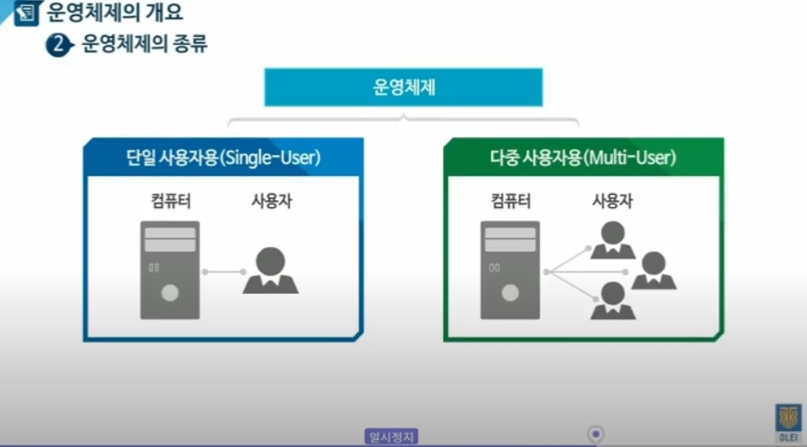
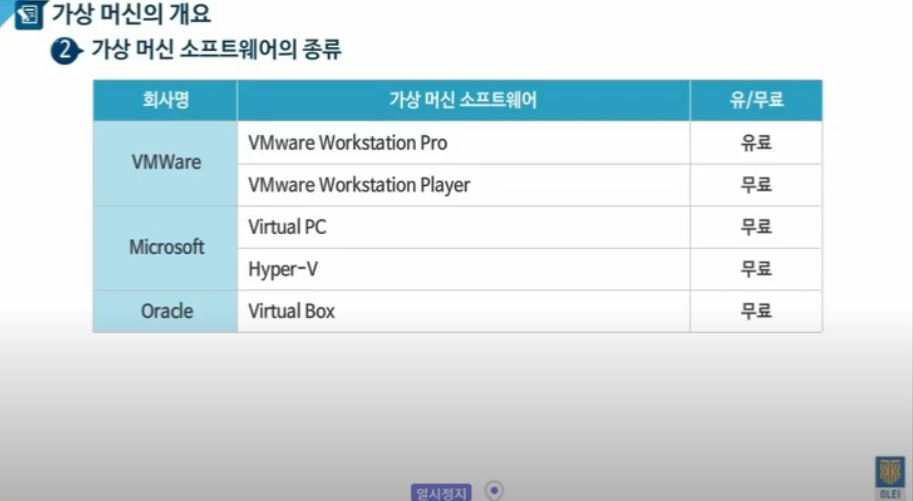

## 응용SW기초기술활용 (v1.0.0)
 
---

- [학습목차](https://github.com/miniplugin/human)
- 능력단위 요소: 2001020216_15v3

---

### 학습개요(아래)

- 응용소프트웨어를 개발하기 위한 기초기술 소개와 활용.

### 학습목표(아래)

- 응용SW개발을 위하여 운영체제,데이터베이스,네트워크의 기초 기술을 적용하고 응용개발에 필요한 환경을 구축할 수 있다.

### 핵심키워드(아래)

- 윈도, 유닉스, 리눅스, 메모리관리, 프로세스관리, OSI 7, 스위칭, 라우터, 클라우드 개발환경 

### 운영체제 기초 활용하기(아래)

- 운영체제의 이해 : OS의 역할과 종류.
- OS의 역할(아래)

- 네트워크에 따른 OS의 종류 : 서버(웹서버-다중사용자), 클라이언트(데스크탑-단일사용자) 

- 운영체제를 설치할 가상머신의 정의및 구조 이해 및 설치실습.

- 실습: 버추얼박스 설치: https://www.virtualbox.org/wiki/Downloads
- 실습: 버추얼박스확장팩 설치:버추얼박스에서 USB 인터페이스 사용이나 호스트↔게스트간 클립보드 복사 및 붙여넣기 기능 사용하기 위해서.

- 실습: 버추럴 박스(오라클)를 이용해 리눅스(데비안) 서버 구동하기. https://bitnami.com/stack/lamp
- 실습결과: http://서버IP (웹브라우저로 접속 확인).
- 실습: 리눅스(데비안) shell 기본명령어 활용. (초기 사용자 정보: bitnami / bitnami )

### 네트워크 기초 활용하기(아래)

- 실습: 윈도우PC(호스트)에서 리눅스(게스트)서버에 ssh(Secure Shell)로 접속해 보기.
- 실습: 퍼티툴사용: http://hputty.org/ (비설치버전 다운로드)
- (SSH서버 활성화) https://docs.bitnami.com/virtual-machine/faq/get-started/enable-ssh/
- 실습: 원격 데이터베이스(Mysql)서버 접속하기. (데이터베이스정보: cat ./bitnami_credentials )
- (ssh 터널링 사용 설정) https://docs.bitnami.com/general/faq/get-started/access-phpmyadmin/
- 실습결과: http://127.0.0.1:8888/phpmyadmin/  

### 데이터베이스 기초 활용하기(아래)

- 실습: 원도우PC에 Mysql 서버설치: https://dev.mysql.com/downloads/mysql/ 
- 실습: 워크벤치 설치. - https://dev.mysql.com/downloads/workbench/
- 실습: 데이터에비스 CRUD 사용하기. - 워크벤치 사용.
- 실습: ER모델을 논리모델과 물리모델로 변환하기 - 워크벤치 사용.
- 실습: 파스타 클라우드 신청(회원가입필요-무료) - https://paas-ta.kr/experience/apply
- 실습: 헤로쿠 클라우드 신청(회원가입필요-무료) - https://dashboard.heroku.com/

### 기본 개발환경 구축하기(아래)

- 실습: 윈도우PC에 자바(openjdk) 설치하기. - https://jdk.java.net/ (8버전을 사용합니다.)
- 실습: 윈도우PC에 서버(톰캣8) 설치하기. - https://archive.apache.org/dist/tomcat/tomcat-8/v8.0.32/bin/
- 실습: 이클립스IDE(전자정부표준프레임웍)개발툴 설치하기. - https://www.egovframe.go.kr
- + 실습을 위해 전자정부표준프레임웍3.9 메이븐 오프라인 버전 으로 통일(아래 / 다운로드 링크 / USB / 윈도우공유폴더/ 중 1가지로 배포)
- + 메이븐 오프라인 버전 다운로드링크:(오픈자바1.8,이클립스,톰캣포함) -다운로드 속도때문에 윈도폴더공유(시작버튼>\\\HU-400-PC )사용추천.
 https://drive.google.com/open?id=1GnIzkvZNgVj-o4EbHzoy5WSDCEWk3GAx
- 실습결과: Hello World 스프링 MVC 프로젝트 생성해서 브라우저로 확인해 보기. http://localhost:8080/프로젝트명/
- 실습: 위 프로젝트를 전자정부표준프레임웍 버전3.9에서 지원하는 자바 버전1.8과 스프링프레임웍 버전4.3.22으로 변경한다.
- 실습: 깃허브 레포지토리 생성(회원가입필요-무료) - https://github.com/
- 실습: 윈도우PC에 버전관리 도구(git) 설치 후 개발도구와 연동(깃허브에 푸시). https://git-scm.com/
- 실습: Hello World 스프링 MVC 프로젝트 클라우드에 배포(헤로쿠)
- + 헤로쿠실습 주의사항(아래): 프로젝트 루트에 Procfile 파일을 생성 한 후 git으로 푸시한다.(헤로쿠에 실행 파일 경로를 알려주는 역할)
- + Procfile작성예) web: java $JAVA_OPTS -jar target/배포폴더이름확인/WEB-INF/lib/webapp-runner-8.0.33.0.jar --port $PORT target/*.war
- + 실습결과: https://학생프로젝트명.herokuapp.com/ (실행예: https://kimilguk.herokuapp.com/ )
- 실습: Hello World 스프링 MVC 프로젝트 클라우드에 배포(파스타)

### 참고자료 출처(아래)

- 위에 사용된 소프트웨어는 자유SW 또는 GNU / LGPL / MIT license 입니다.
- [NCS학습모듈] https://ncs.go.kr/unity/th03/ncsSearchMain.do :/정보통신/정보기술/정보기술개발/응용SW기초기술활용
- 우분투 리눅스 설치 iso이미지 : http://releases.ubuntu.com
- [STEP온라인평생교육원] 응용 SW 기초 기술 활용 part 1(유투브)
- https://www.youtube.com/watch?v=fmSEG6djoRA
- [STEP온라인평생교육원] 응용 SW 기초 기술 활용 part 2(유투브)
- https://www.youtube.com/watch?v=UmnOIX2NQrk
- [강사 블로그] http://blog.daum.net/web_design/553
