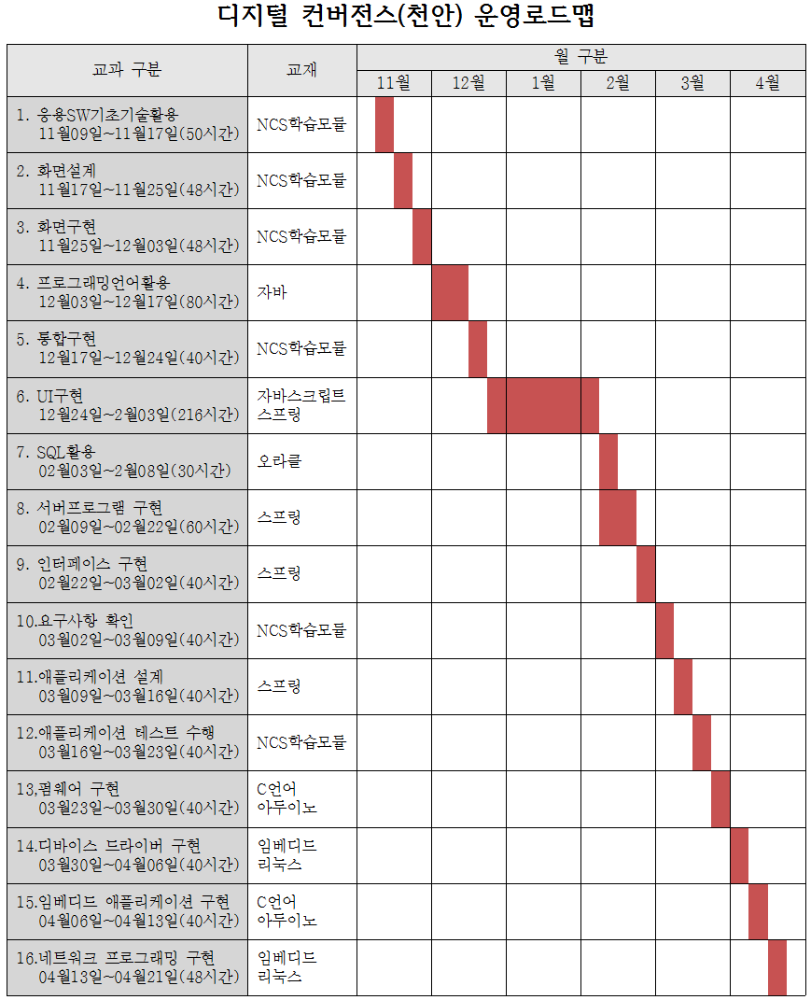

## 커리큘럼
 
---

- [학습목차](https://github.com/miniplugin/human)
- 교사정보: 김일국, boramcom@daum.net, 010-8175-6075
- 학습목표
```
디지털 기술을 기반으로 다양한 기기의 융합, 콘텐츠의 융합을 통해 새로운 형태의 제품이나 융합서비스를 창출합니다.
기기/콘텐츠의 기획/설계/제작/운용/시험을 수행 할 수 있는 4차산업혁명의 핵심적인 과정을 습득합니다.
```
- [목차사용법]깃허브 태그[tag] 클릭, 예) [v1.0.0] <- 아래에서 해당부분 클릭하시면 해당과목으로 이동합니다.  

---

### [v1.0.0](https://github.com/miniplugin/human/tree/v1.0.0) 응용SW기초기술활용 (2001020216_15v3)

- 11월09일~11월17일(50시간) : 사전평가(11월09일) /사후평가(11월17일,2교시)
- 평가항목(수준3) : 사후 + 평가자체크리스트 + 서술형

### [v2.0.0](https://github.com/miniplugin/human/tree/v2.0.0) 화면설계 (2001020224_16v4)

- 11월17일~11월25일(48시간) : 사전평가(11월17일) /사후평가(11월25일,2교시)
- 평가항목 (수준5): 사후 + 포트폴리오

### [v3.0.0](https://github.com/miniplugin/human/tree/v3.0.0) 화면구현 (2001020225_16v4)

- 11월25일~12월03일(48시간) : 사전평가(11월25일) /사후평가(12월03일,2교시)
- 평가항목(수준3) : 사후 + 포트폴리오

### [v4.0.0](https://github.com/miniplugin/human/tree/v4.0.0) 프로그래밍언어활용 (2001020215_15v3)

- 12월03일~12월17일(80시간) : 사전평가(12월03일) /사후평가(12월17일,2교시)
- 평가항목(수준3) : 사후 + 문제해결시나리오

### [v5.0.0](https://github.com/miniplugin/human/tree/v5.0.0) 통합구현 (2001020206_16v4)

- 12월17일~12월24일(40시간) : 사전평가(12월17일) /사후평가(12월24일,2교시)
- 평가항목(수준5) : 사후 + 문제해결시나리오

### [v6.0.0](https://github.com/miniplugin/human/tree/v6.0.0) UI구현 (2001020708_17v2)

- 12월24일~02월03일(216시간) : 사전평가(12월24일) /사후평가(02월03일,2교시)
- 평가항목(수준3) : 사후 + 포트폴리오

### [v7.0.0](https://github.com/miniplugin/human/tree/v7.0.0) SQL활용 (2001020413_16v3)

- 02월03일~02월08일(30시간) :  사전평가(02월03일) /사후평가(02월08일,8교시)
- 평가항목(수준3) : 사후 + 문제해결시나리오 + 서술형

### [v8.0.0](https://github.com/miniplugin/human/tree/v8.0.0) 서버프로그램 구현 (2001020211_16v4)

- 02월09일~02월22일(60시간) : 사전평가(02월09일) /사후평가(02월22일,4교시)
- 평가항목(수준5) : 사후 + 포트폴리오

### [v9.0.0](https://github.com/miniplugin/human/tree/v9.0.0) 인터페이스 구현 (2001020212_16v4)

- 02월22일~03월02일(40시간) : 사전평가(02월22일) /사후평가(03월02일,4교시)
- 평가항목(수준5) : 사후 + 문제해결시나리오

### [v10.0.0](https://github.com/miniplugin/human/tree/v10.0.0) 요구사항 확인 (2001020201_16v3)

- 03월02일~03월09일(40시간) : 사전평가(03월02일) /사후평가(03월09일,4교시)
- 평가항목(수준5) : 사후 + 평가자체크리스트

### [v11.0.0](https://github.com/miniplugin/human/tree/v11.0.0) 애플리케이션 설계 (2001020221_16v4)

- 03월09일~03월16일(40시간) : 사전평가(03월09일) /사후평가(03월16일,4교시)
- 평가항목(수준6) : 사후 + 평가자체크리스트 + 서술형

### [v12.0.0](https://github.com/miniplugin/human/tree/v12.0.0) 애플리케이션 테스트 수행 (2001020227_16v4)

- 03월16일~03월23일(40시간) : 사전평가(03월16일) /사후평가(03월23일,4교시)
- 평가항목(수준3) : 사후 + 문제해결시나리오

### [v13.0.0](https://github.com/miniplugin/human/tree/v13.0.0) 펌웨어 구현 (2001020314_17v5)

- 03월23일~03월30일(40시간) : 사전평가(03월23일) /사후평가(03월30일,4교시)
- 평가항목(수준5) : 사후 + 문제해결시나리오

### [v14.0.0](https://github.com/miniplugin/human/tree/v14.0.0) 디바이스 드라이버 구현 (2001020320_17v5)

- 03월30일~04월06일(40시간) : 사전평가(03월30일) /사후평가(04월06일,4교시)
- 평가항목(수준6) : 사후 + 문제해결시나리오

### [v15.0.0](https://github.com/miniplugin/human/tree/v15.0.0) 임베디드 애플리케이션 구현 (2001020324_17v5)

- 04월06일~04월13일(40시간) : 사전평가(04월06일) /사후평가(04월13일,4교시)
- 평가항목(수준5) : 사후 + 포트폴리오

### [v16.0.0](https://github.com/miniplugin/human/tree/v16.0.0) 네트워크 프로그래밍 구현 (2001020508_14v2)

- 04월13일~04월21일(48시간) : 사전평가(04월13일) /사후평가(04월21일,4교시)
- 평가항목(수준3) : 사후 + 포트폴리오



### 교재별 소스 정보(아래)

---
- 스프링
#### 참고자료: https://github.com/miniplugin/edu_ora/blob/master/spring5.md
#### 예제소스: https://github.com/madvirus/spring5fs
#### 강사자료: http://blog.daum.net/web_design/search/%EC%8A%A4%ED%94%84%EB%A7%81%20%EC%9B%B9%ED%94%84%EB%A1%9C%EC%A0%9D%ED%8A%B8%20%EC%97%B0%EC%8A%B5
---

--- 
- 자바스크립트
#### 예제소스: http://www.webdongne.com/bbs/bbs/board.php?bo_table=wbook_list&wr_id=12
#### 맛보기(ebook): https://www.epubx.com/book/291
---

--- 
- 오라클
#### 예제소스: https://github.com/gilbutITbook/006696
#### 강사자료: http://blog.daum.net/web_design/725 (기존 스프링 웹프로젝트를 오라클용으로_1 )
---

--- 
- 이것이 자바다
#### 강사자료: 구글프레젠테이션 https://drive.google.com/file/d/1Ns6S2g7RNdrspqnGXwCfGnEEWJ3j3KOx/view?usp=sharing
#### 참고자료: https://www.youtube.com/playlist?list=PLVsNizTWUw7FPokuK8Cmlt72DQEt7hKZu
#### 예제소스: https://www.hanbit.co.kr/support/supplement_list.html
---

---
- C언어 
#### 강사자료: 구글프레젠테이션 https://drive.google.com/file/d/1uBq1FzFZyrc9T-gpU4S9W39rQL3gB6lC/view?usp=sharing
#### 참고자료: https://freelec.co.kr/lecture/c-%EC%96%B8%EC%96%B4%EC%9D%98-%EB%B3%B8%EC%A7%88%EC%9D%84-%ED%8C%8C%ED%97%A4%EC%B9%98%EB%8B%A4/
#### 예제소스: https://freelec.co.kr/datacenter/?mode=list&board_name=DataCenter2&order_by=fn_pid&order_type=desc&category1=&category2=&category3=&search_field=fn_title&search_text=C+%EC%96%B8%EC%96%B4+%EB%B3%B8%EC%83%89
#### C언어이론 실습은 구름클라우드에서 합니다: https://ide.goorm.io/
---

---
- 임베디드 리눅스
#### 임베디드 프로그램으로 할 수 있는 작업 예: https://www.youtube.com/watch?v=WayCRcelbTU 동영상 2분06초 부분에 내용 있음.
#### 안드로이드 스튜디오 + SDK 구글드라이브에서 다운로드: https://drive.google.com/file/d/17y9mVdJ6Isgom1AQKpoFi5WIPQkDvWN4/view?usp=sharing
#### 예제소스: [download this](git_img/Embeded-System-2019-2.zip)
#### 라즈베리 GPIO사용 하드웨어 제어: GCC컴파일 + wiringPi 라이브러리 사용 / http://blog.daum.net/ejleep1/search/wiringPi 
#### 참고자료: http://blog.naver.com/PostSearchList.nhn?blogId=tipsware&categoryNo=0&SearchText=%EB%9D%BC%EC%A6%88%EB%B2%A0%EB%A6%AC+%ED%8C%8C%EC%9D%B4+%EC%8B%A4%EC%8A%B5&orderBy=date&term=specific&startDate=2017-05-16&endDate=2017-05-23&range=all&cpage=2
#### 라즈베리안 설치 및 백업(복구) 소프트웨어(설치-Etcher,복구-Win32Diskmager)사용 : 라즈베리에서 제공하는 imager는 너무 느림. 
#### 라즈베리 설치 참고자료: https://blog.xcoda.net/82 / 라즈베리 백업 참고자료: https://withcoding.com/99
#### 라즈베리안 설치에 사용되는 Etcher 프로그램 다운로드 위치: https://www.balena.io/etcher/
#### 라즈베리안 다운로드 위치: https://www.raspberrypi.org/downloads/raspbian/
#### 라즈베리파이 초기 셋팅시 암호 apmsetup으로 변경 및 국가 한국어로 선택해서 마무리.
#### 와이파이 버그처리: 라즈베리 환경설정 메뉴에서 Localisation > Set WiFi Country 에서 GB Britain(UK)선택.
#### 인터넷이 활성화 되면, 터미널에서 sudo apt-get update 다음 sudo apt-get upgrade
#### 한글 깨져보인는 버그처리: 터미널에서 sudo apt-get install fonts-unfonts-core 여기까지 하고 reboot.
#### 한글 입력 않되는 버그처리: 터미널에서 sudo apt-get install fcitx 다음 sudo apt-get install fcitx-hangul
#### 한글 입력기가 나오지않는 버그처리: 터미널에서 im-config -n fcitx 후 reboot(기술참고: http://blog.naver.com/PostView.nhn?blogId=linuxni&logNo=221497654453 ) 
#### 라즈베리 바탕화면 Menu > Preferences > Raspberry Pi Configuration > Interfaces를 선택 SSH, VNC 활성화 후 학생PC에서 접속해 보기. PC에 VNC뷰어설치 https://www.realvnc.com/download/viewer/
---

---
- 아두이노
#### 예제소스: http://www.kwangmoonkag.co.kr/sub3/sub3_1.html?target=Board_List&DB=sub3_1&Mode=View&Num=852&page=1&S=S&val=0&Word=&Board_TYPE=&PHPSESSID=03901ac7ddf268e8562dfba0413f5f1a
#### 실습에 사용될 NODE MCU ESP8266보드 확인: http://makeshare.org/bbs/board.php?bo_table=project&wr_id=201
#### CP210x USB to UART Bridge 드라이버 설치하기(윈7용): http://www.iamamaker.kr/ko/tutorials/cp210x-usb-to-uart-%EB%93%9C%EB%9D%BC%EC%9D%B4%EB%B2%84-%EC%84%A4%EC%B9%98%ED%95%98%EA%B8%B0/
#### 윈7용 UART드라이버 다운로드: https://www.silabs.com/products/development-tools/software/usb-to-uart-bridge-vcp-drivers
#### 아두이노 IDE(통합개발환경) 설치 파일 다운로드: https://www.arduino.cc/
#### NODE MCU개발환경구축하기: https://blog.naver.com/PostView.nhn?blogId=roboholic84&logNo=221187841348
#### LED_BUILTIN 깜박이기: https://developer.ibm.com/kr/cloud/internet-of-things/2017/07/30/esp8266-iot-arduino-ide-nodemcu-basic/
#### 참고사항 NODE MCU보드 강좌: https://blog.naver.com/PostSearchList.nhn?SearchText=NodeMCU+%EA%B0%95%EC%A2%8C&blogId=roboholic84
#### 강사자료(아두이노메가2560): http://blog.daum.net/_blog/search.do?coll_range=1&query1=%EC%95%84%EB%91%90%EC%9D%B4%EB%85%B8&searchtype=%24%7Bsearchtype%7D&page=%2Fsearch%2Fmy%2FsearchBlog.vm&frombn=2&searchpage=&sort=&blogid=0FnMj&articleno=&recommend=N&sortType=recency&enddate=&begindate=&period=&category=0&target=all
#### Do it! 안드로이드 앱 프로그래밍
- 2020.03.04. 전자책 출간 / 2020.02.21. 종이책 출간
- 무작정 따라하기 챕터3강의안(2015출판,안드로이드스튜디오2.3버전) : https://slidesplayer.org/slide/14087618/
- 최신버전4.0.1구글클라우드다운로드: https://drive.google.com/file/d/1X9wu2DCLJBbyuZ6BsIxV4U7wLsn-t6WW/view?usp=sharing
- 저자카페: https://cafe.naver.com/techtown
- 저자깃: https://github.com/mike-jung/DoItAndroid
- 유투브채널: https://www.youtube.com/playlist?list=PLG7te9eYUi7sjJzJR2i5m6wv-X_7K2pVE
- VT-x 설정확인: https://www.grc.com/securable.htm 프로그램
- VT-x 설정이enabled 정상인데도 아래와 같은 에러 메시지 보일때,
- HAXM device is not found in Windows 7 에러 상황시 현재 설치된v7.5.6 에서 에러가 발생 되었음.
- 처리는 v7.5.1 로 설치 후 OK. https://github.com/intel/haxm/releases
- [위 7.5.1버전 바로download this](git_img/haxm-windows_v7_5_1.zip)
- 주의) 윈도우사용자계정이름이 한글이면, AVD애뮬레이터 실행시 에러가 발생 됩니다. 계정이름을 영문으로 변경하셔야 합니다.
---

---
- NCS학습모듈 
#### 참고자료: https://ncs.go.kr/unity/th03/ncsSearchMain.do :/정보통신/정보기술/정보기술개발
#### 전자정부표준프레임웍3.9버전 개발환경 다운로드(아래 배포사이트) 
 https://www.egovframe.go.kr/EgovDevEnvRelease_300.jsp?menu=3&submenu=2&leftsub=2
#### 참고자료: Hello World MVC프로젝트 생성시 템플릿확인(아래) 
#### 참고자료: 템플릿:https://dist.springsource.com/release/STS/help/org.springframework.templates.mvc-3.2.2.zip
#### 참고자료: 위 템플릿 동시접속 문제로 보이지 않을때 다른 주소: http://timespace12.dothome.co.kr/org.springframework.templates.mvc-3.2.2.zip
#### 오픈JDK1.8다른버전: https://drive.google.com/open?id=1KmlDcLnqO5dLmAN64_a1sa7Ot9318yby
---

---
#### 학생PC 환경 
- 기본브라우저: 크롬 ( 설정: Flash플레이어 허용-교사 다음카페에 과제물제출을 위해서... )
- 다음카페 도움말: https://cs.daum.net/faq/36/4417.html?faqId=32547
- 과제물제출처: 교사 다음카페 ( http://cafe.daum.net/human22 ) 학생 카페가입 후 교사가 정회원처리 후 이용가능.
- 유스케이스 실습자료: [download this](git_img/usecase.jpg)
- 교사PC화면공유SW설치(오프라인수업시): https://drive.google.com/file/d/1H5efmROpNFm2zY33RgSx5jsETLI795Ga/view?usp=sharing
- UI디자인 & Development개발 가이드 샘플: https://drive.google.com/file/d/1JsAIwUItL2phlsXEwQ7yK-BOA7mbizJ-/view
- 학생작업샘플다운로드: https://drive.google.com/file/d/1TWohmhcdzOqY0P9mX1SmfmXVYcZTnrJo/view?usp=sharing 
- 화면구현 프로젝트 관리자단 home.html 디자인시안 : [보기](git_img/AdminLte_home.jpg)

#### 매달 초 자리바꾸기 공개용프로그램 자리이동.
- 변경기준: 자리바꾸기 공개용프로그램-주최자:교사(아래)
- [자리바꾸기 공개용프로그램 배포처 확인 링크](https://sciencelove.com/2353)
- 자리 이동 후 작업내용(git소스) 초기화 방법(아래)
- 이클립스에서 다른 학생의 기존 프로젝트 삭제
- 작업폴더 터미널에서 깃저장소 복제: git clone 본인 깃주소
- 이클립스에서 작업폴더에 프로젝트 임포트(import)
- 이클립스 메뉴에서 Window>Preferences>Team>Git>Configuration 에서 결과확인
- 이전과 동일하게 학생 본인 작업 시작
---

### 스프링 프로젝트 오라클 작업용 DB백업파일 다운로드(아래)
[download this](git_img/oracle_20200803.sql)

### 전자정부표준프레임워크 설계패키지정의서
[download this](git_img/egov_package.xls)

### RestAPI와 연동된 시각화 도구 (아래 오픈소스 사용)
[챠트예제 소스 download this](git_img/chart.html)

- 위 챠트소스에 적용된 내역은 아래와 같습니다.
- 챠트소스URL: https://www.chartjs.org/
- 라이센스정보: https://www.chartjs.org/docs/latest/notes/license.html (MIT라이센스)
- 막대챠트: https://www.chartjs.org/docs/latest/charts/bar.html
- 레이다챠트 : https://www.chartjs.org/docs/latest/charts/radar.html

### 프런트엔드 개발자용 코딩테스트 설명과 소스: 아래(취업 코딩테스트 대비용)
- [프런트엔드 개발자용 설명 download this](git_img/coding_test.txt)
- [프런트엔드 개발자용 코딩 download this](git_img/coding_test.zip)

### 비대면 수업시 필요한 프로그램 다운로드 목록(6개)
- 1. 이클립스 (egov.zip) 다운로드 위치 https://drive.google.com/file/d/1GnIzkvZNgVj-o4EbHzoy5WSDCEWk3GAx/view?usp=sharing
- 주) 반드시 C:\egov 에 압축을 풀어야 합니다. 
- 2. wamp 다운로드 위치 https://drive.google.com/file/d/1r2tUfV_eeYS2XhzXKabCZeEgeLP-LYL0/view?usp=sharing
- 주1), mysql root암호 apmsetup 으로 추가해 주셔야 합나다. 
```
1. 윈amp 작업표시줄의 아이콘 클릭 > phpMyAdmin > 로그인 후 > mysql 데이터베이스 user 테이블 선택 > root 선택 > 수정버튼 클릭
> authentication_string 필드 타입 password 선택 후 apmsetup 입력 후 실행 버튼 클릭
2. phpMyadmin 홈버튼 클릭 > 사용자 계정 탭메뉴 클릭 > 하단에 reload privileges 링크 클릭
3. 로그아웃 후 로그인 (root / apmsetup) 확인
```

  주2), 한글 입출력이 가능하게 my.ini 하단에 추가해 주셔야 합니다.
```
1. 윈amp 작업표시줄의 아이콘 클릭 > MySQL > my.ini 클릭 후 제일 하단에 아래 내용 추가
[client]
default-character-set=utf8
[mysqldump] 
default-character-set = utf8
[mysql]
default-character-set=utf8
[mysqld]
init_connect="SET collation_connection = utf8_general_ci"
init_connect="SET NAMES utf8"
character-set-server = utf8

```
- 한글 입출력 적용하시려면, 만세아이콘 정지 후 재시작 하시면 한글 입출력 적용이 됩니다.

- 3. 워크벤치(mysql용) 다운로드 위치 https://drive.google.com/file/d/1j1GUtVGrB0IFxYv4_57r1PeThiWqNfs7/view?usp=sharing
- 4. 안드로이드스튜디오.zip 다운로드 위치 https://drive.google.com/file/d/17y9mVdJ6Isgom1AQKpoFi5WIPQkDvWN4/view?usp=sharing
- 주) 반드시 C:\Android 에 압축을 풀어야 합니다.
- 5. 오라클서버 다운로드 위치 https://drive.google.com/file/d/1L2XZuH-j47PaoscLNn16kqjPxFYmhi_F/view?usp=sharing
- 주1) 오라클서버 설치하시기 전 이클립스에서 톰캣을 실행(자동포트 8080)하신 상태에서 설치하시면, 오라클서버 포트 바꾸는 수고를 하지 않아도 됩니다.
- 주2) 오라클 서버 설치시 포트번호를 9000 으로 잡아 주시면 됩니다. 또는 https://github.com/miniplugin/human/tree/v8.0.0 문서의 참고자료출처 부분에 해결책이 있습니다.
- 6. sql디벨러퍼(oracle용) 다운로드 위치 https://drive.google.com/file/d/1n7jy85OeI06ipmDjKWFYxaYpTJY16lj-/view?usp=sharing
- 7. 공통 주의) 여러 학생들 git 소스 에 .gitignore 에 root-context.xml와 servlet-context.xml 파일을 제외 시키는 코드가 있어서 누락된 파일이 존재 할 수 있습니다.
- Ps. 온라이 제안요청서 확인 https://www.smu.ac.kr/flexer/index.jsp?ftype=hwp&attachNo=467744
- Ps. 원격지원에 사용할 팀뷰어 프로그램 구글 드라이브 위치 입니다. https://drive.google.com/file/d/1NSj_qpwT35kA3ZUVKiZD9C7M6vTl2rgK/view?usp=sharing

#### 맥북(애플) 사용자를 위한 부트캠프로 윈도우OS 설치 후 멀티부팅을 사용해서 교육용 윈도우 개발환경과 같은 결과가 나오게 사용할 수 있습니다.
- 참조: https://m.blog.naver.com/PostView.nhn?blogId=aprilproj&logNo=220794261348&proxyReferer=https:%2F%2Fwww.google.com%2F
- 조건, 단 Mysql(한글설정)을 사용하기 위한 wamp 설치에서, mysql(3308로 변경)은 실행이 않되고, MariaDB(3306로 변경)를 사용하셔야 합니다. 상단에서 작업하는 스프링 프로젝트 2가지는 Mysql 과 Maria DB가 소스 수정없이 동일한 결과가 나옵니다.

#### 교실에서 줌 접속 테스트 했습니다. 실제 수업전 휴먼교육센터에서 카톡 오픈채팅방으로 학생들에게 접속주소를 안내할 예정 입니다.
- 오픈채팅방 주소 : https://open.kakao.com/o/gCdXuNEc
