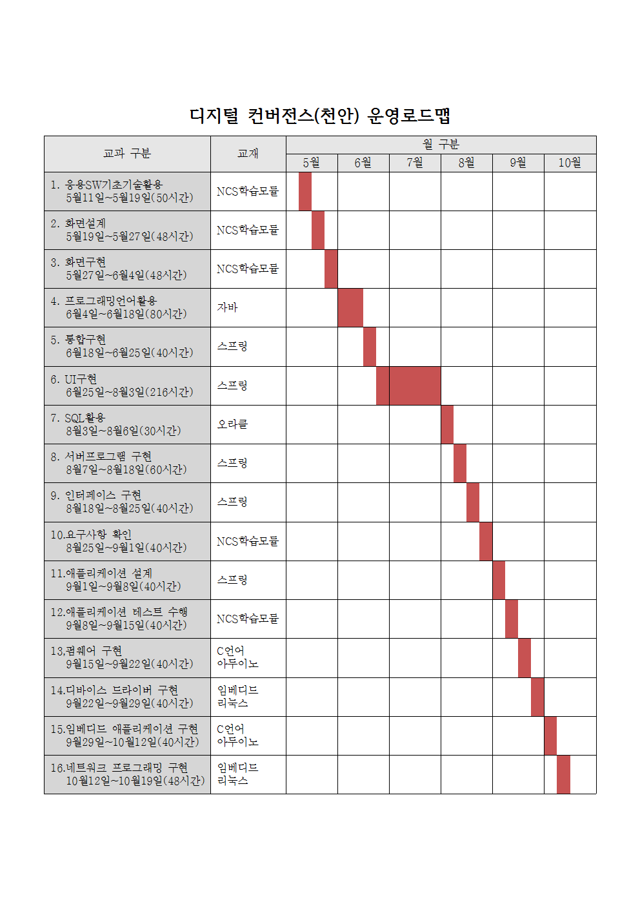

## 커리큘럼
 
---

- [학습목차](https://github.com/miniplugin/human)
- 교사정보: 김일국, boramcom@daum.net, 010-8175-6075
- 학습목표
```
디지털 기술을 기반으로 다양한 기기의 융합, 콘텐츠의 융합을 통해 새로운 형태의 제품이나 융합서비스를 창출합니다.
기기/콘텐츠의 기획/설계/제작/운용/시험을 수행 할 수 있는 4차산업혁명의 핵심적인 과정을 습득합니다.
```
- [목차사용법]깃허브 태그[tag] 클릭, 예) [v1.0.0] <- 아래에서 해당부분 클릭하시면 해당과목으로 이동합니다.  

---

### [v1.0.0](https://github.com/miniplugin/human/tree/v1.0.0) 응용SW기초기술활용 (2001020216_15v3)

- 5월11일~5월19일(50시간) : 사전평가(5월11일) /사후평가(5월19일,2시간)
- 평가항목(수준3) : 사후 + 평가자체크리스트 + 서술형

### [v2.0.0](https://github.com/miniplugin/human/tree/v2.0.0) 화면설계 (2001020224_16v4)

- 5월19일~5월27일(48시간) : 사전평가(5월19일) /사후평가(5월27일)
- 평가항목 (수준5): 사후 + 포트폴리오

### [v3.0.0](https://github.com/miniplugin/human/tree/v3.0.0) 화면구현 (2001020225_16v4)

- 5월27일~6월4일(48시간) : 사전평가(5월27일) /사후평가(6월4일)
- 평가항목(수준3) : 사후 + 포트폴리오

### [v4.0.0](https://github.com/miniplugin/human/tree/v4.0.0) 프로그래밍언어활용 (2001020215_15v3)

- 6월4일~6월18일(80시간) : 사전평가(6월4일) /사후평가(6월18일)
- 평가항목(수준3) : 사후 + 문제해결시나리오

### [v5.0.0](https://github.com/miniplugin/human/tree/v5.0.0) 통합구현 (2001020206_16v4)

- 6월18일~6월25일(40시간) : 사전평가(6월18일) /사후평가(6월25일)
- 평가항목(수준5) : 사후 + 문제해결시나리오

### [v6.0.0](https://github.com/miniplugin/human/tree/v6.0.0) UI구현 (2001020708_17v2)

- 6월25일~8월3일(216시간) : 사전평가(6월25일) /사후평가(8월3일)
- 평가항목(수준3) : 사후 + 포트폴리오

### [v7.0.0](https://github.com/miniplugin/human/tree/v7.0.0) SQL활용 (2001020413_16v3)

- 8월3일~8월6일(30시간) :  사전평가(8월3일) /사후평가(8월6일)
- 평가항목(수준3) : 사후 + 문제해결시나리오 + 서술형

### [v8.0.0](https://github.com/miniplugin/human/tree/v8.0.0) 서버프로그램 구현 (2001020211_16v4)

- 8월7일~8월18일(60시간) : 사전평가(8월7일) /사후평가(8월18일)
- 평가항목(수준5) : 사후 + 포트폴리오

### [v9.0.0](https://github.com/miniplugin/human/tree/v9.0.0) 인터페이스 구현 (2001020212_16v4)

- 8월18일~8월25일(40시간) : 사전평가(8월18일) /사후평가(8월24일)
- 평가항목(수준5) : 사후 + 문제해결시나리오

### [v10.0.0](https://github.com/miniplugin/human/tree/v10.0.0) 요구사항 확인 (2001020201_16v3)

- 8월25일~9월1일(40시간) : 사전평가(8월25일) /사후평가(9월1일)
- 평가항목(수준5) : 사후 + 평가자체크리스트

### [v11.0.0](https://github.com/miniplugin/human/tree/v11.0.0) 애플리케이션 설계 (2001020221_16v4)

- 9월1일~9월8일(40시간) : 사전평가(9월1일) /사후평가(9월8일)
- 평가항목(수준6) : 사후 + 평가자체크리스트 + 서술형

### [v12.0.0](https://github.com/miniplugin/human/tree/v12.0.0) 애플리케이션 테스트 수행 (2001020227_16v4)

- 9월8일~9월15일(40시간) : 사전평가(9월8일) /사후평가(9월15일)
- 평가항목(수준3) : 사후 + 문제해결시나리오

### [v13.0.0](https://github.com/miniplugin/human/tree/v13.0.0) 펌웨어 구현 (2001020314_17v5)

- 9월15일~9월22일(40시간) : 사전평가(9월15일) /사후평가(9월22일)
- 평가항목(수준5) : 사후 + 문제해결시나리오

### [v14.0.0](https://github.com/miniplugin/human/tree/v14.0.0) 디바이스 드라이버 구현 (2001020320_17v5)

- 9월22일~9월29일(40시간) : 사전평가(9월22일) /사후평가(9월29일)
- 평가항목(수준6) : 사후 + 문제해결시나리오

### [v15.0.0](https://github.com/miniplugin/human/tree/v15.0.0) 임베디드 애플리케이션 구현 (2001020324_17v5)

- 9월29일~10월12일(40시간) : 사전평가(9월29일) /사후평가(10월12일)
- 평가항목(수준5) : 사후 + 포트폴리오

### [v16.0.0](https://github.com/miniplugin/human/tree/v16.0.0) 네트워크 프로그래밍 구현 (2001020508_14v2)

- 10월12일~10월19일(48시간) : 사전평가(10월12일) /사후평가(10월19일)
- 평가항목(수준3) : 사후 + 포트폴리오


### 교재별 소스 정보(아래)

---
- 스프링
#### 참고자료: https://github.com/miniplugin/edu_ora/blob/master/spring5.md
#### 예제소스: https://github.com/madvirus/spring5fs
#### 강사자료: http://blog.daum.net/_blog/search.do?coll_range=1&query1=%EC%8A%A4%ED%94%84%EB%A7%81+%EC%9B%B9%ED%94%84%EB%A1%9C%EC%A0%9D%ED%8A%B8+%EC%97%B0%EC%8A%B5&searchtype=%24%7Bsearchtype%7D&page=%2Fsearch%2Fmy%2FsearchBlog.vm&frombn=2&searchpage=&sort=&blogid=0FnMj&articleno=&recommend=N&sortType=recency&enddate=&begindate=&period=&category=0&target=all
---

--- 
- 자바스크립트
#### 예제소스: http://www.webdongne.com/bbs/bbs/board.php?bo_table=wbook_list&wr_id=12
#### 맛보기(ebook): https://www.epubx.com/book/291
---

--- 
- 오라클
#### 예제소스: https://github.com/gilbutITbook/006696
#### 강사자료: http://blog.daum.net/web_design/725 (기존 스프링 웹프로젝트를 오라클용으로_1 )
---

--- 
- 이것이 자바다
#### 참고자료: https://www.youtube.com/playlist?list=PLVsNizTWUw7FPokuK8Cmlt72DQEt7hKZu
#### 예제소스: https://www.hanbit.co.kr/support/supplement_list.html
---

---
- C언어 
#### 참고자료: https://freelec.co.kr/lecture/c-%EC%96%B8%EC%96%B4%EC%9D%98-%EB%B3%B8%EC%A7%88%EC%9D%84-%ED%8C%8C%ED%97%A4%EC%B9%98%EB%8B%A4/
#### 예제소스: https://freelec.co.kr/datacenter/?mode=list&board_name=DataCenter2&order_by=fn_pid&order_type=desc&category1=&category2=&category3=&search_field=fn_title&search_text=C+%EC%96%B8%EC%96%B4+%EB%B3%B8%EC%83%89
---

---
- 임베디드 리눅스
#### 예제소스: [download this](git_img/Embeded-System-2019-2.zip)
#### 라즈베리 GPIO사용 하드웨어 제어: GCC컴파일 + wiringPi 라이브러리 사용 / 
http://blog.daum.net/_blog/search.do?coll_range=1&query1=WiringPi&searchtype=&page=1&frombn=2&searchpage=&sort=&blogid=0aJjX&articleno=&recommend=N&sortType=accuracy&enddate=&begindate=&period=&category=0&target=all 
#### 참고자료: http://blog.naver.com/PostSearchList.nhn?blogId=tipsware&categoryNo=0&SearchText=%EB%9D%BC%EC%A6%88%EB%B2%A0%EB%A6%AC+%ED%8C%8C%EC%9D%B4+%EC%8B%A4%EC%8A%B5&orderBy=date&term=specific&startDate=2017-05-16&endDate=2017-05-23&range=all&cpage=2
#### 영상자료1: https://www.youtube.com/watch?v=_fnPwBOk3OI (Raspbian으로 개발환경구축)
#### 영상자료2: https://www.youtube.com/watch?v=RRKDUj3G-H8 (NOOBS로 개발환경구축)
#### 영상자료3: https://www.youtube.com/watch?v=PySvSQ6n6mw (초기로그인:pi/raspberry)
---

---
- 아두이노
#### 예제소스: http://www.kwangmoonkag.co.kr/sub3/sub3_1.html?target=Board_List&DB=sub3_1&Mode=View&Num=852&page=1&S=S&val=0&Word=&Board_TYPE=&PHPSESSID=03901ac7ddf268e8562dfba0413f5f1a
#### 강사자료(아두이노메가2560): http://blog.daum.net/_blog/search.do?coll_range=1&query1=%EC%95%84%EB%91%90%EC%9D%B4%EB%85%B8&searchtype=%24%7Bsearchtype%7D&page=%2Fsearch%2Fmy%2FsearchBlog.vm&frombn=2&searchpage=&sort=&blogid=0FnMj&articleno=&recommend=N&sortType=recency&enddate=&begindate=&period=&category=0&target=all
#### 참고자료1(아두이노미니): https://deneb21.tistory.com/325 , https://deneb21.tistory.com/393
---

---
- NCS학습모듈 
#### 참고자료: https://ncs.go.kr/unity/th03/ncsSearchMain.do :/정보통신/정보기술/정보기술개발
---

---
#### 학생PC 환경 
- 기본브라우저: 크롬 ( 설정: Flash플레이어 허용-교사 다음카페에 과제물제출을 위해서... )
- 다음카페 도움말: https://cs.daum.net/faq/36/4417.html?faqId=32547
- 과제물제출처: 교사 다음카페 ( http://cafe.daum.net/human20 ) 학생 카페가입 후 교사가 정회원처리 후 이용가능.

#### 매주 월요일 마다 학생 본인 좌측 으로 자리 이동. ->[변경 후] 매달 초 자리바꾸기 공개용프로그램 자리이동.
- 변경기준: 자리바꾸기 공개용프로그램-주최자:교사(아래)
- [자리바꾸기 공개용프로그램](https://sciencelove.com/2353)
- 자리 이동 후 작업내용(git소스) 초기화 방법(아래)
- 이클립스에서 다른 학생의 기존 프로젝트 삭제
- 작업폴더 터미널에서 깃저장소 복제: git clone 본인 깃주소
- 이클립스에서 작업폴더에 프로젝트 임포트(import)
- 이클립스 메뉴에서 Window>Preferences>Team>Git>Configuration 에서 결과확인
- 이전과 동일하게 학생 본인 작업 시작
---