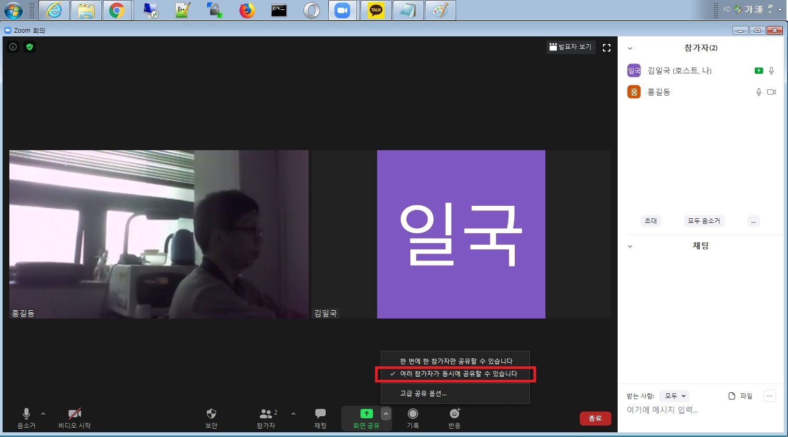

### 강사의 Zoom 사용법 
#### 학생이 수업중에 강사에게 본인 PC의 코딩에러에 대해 질문하시는 방법을 줌 사용법과 함께 올립니다.
- 강사시작. Zoom 앱에 구글아이디로 로그인 합니다.
- 01. 줌 일반설정 3가지를 확인합니다.
    (듀얼모니터를 클릭하면 모든학생얼굴창+원격제어학생창+강사공유창 3가지가 모두보입니다.): 아래

- 02. 화면 공유 옵션을 확인 합니다.(빨간색으로 강조한 부분 확인): 아래

- 03. Zoom회의 화면하단에 화면공유 > 여러 참가자가 동시에 공유할 수 ... 클릭합니다.: 아래

- 04. 학생이 본인화면을 공유하면, Zoom회의에 나타납니다. 홍길동학생화면에 원격제어 요청을 클릭합니다.: 아래

- 05. 학생이 본인PC제어를 승인 하게 되면, 강사Zoom 회의화면에 제어를 시작한다는 메세지가 나옵니다.: 아래

- 06. 학생PC를 공유 중지 하려면 상단에 옵션보기 > 참가자의 공유 중지 를 클릭합니다.: 아래

- 07. 학생 PC를 제어할때 강사PC의 화면 구성은 3개로 나오게 됩니다.
    모든학생얼굴창 + 원격제어학생창 + 강사공유창: 아래

